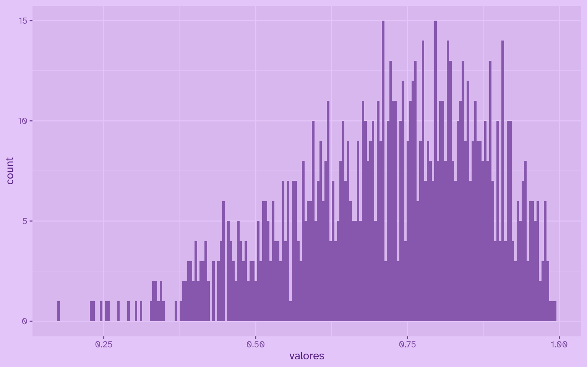
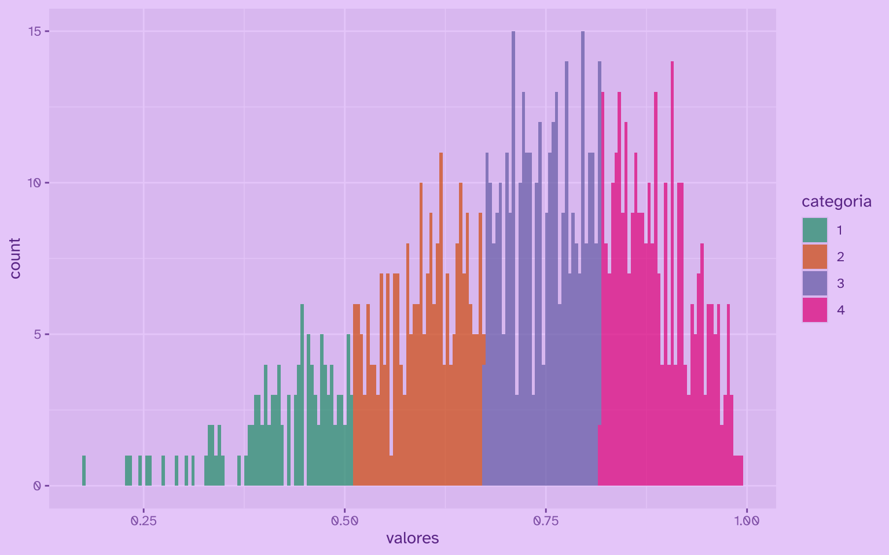

El método de cortes naturales de Jenks se usa para categorizar variables contínuas en variables ordinales; es decir, pasar de una variable numérica a la cantidad de categorías discretas que necesitemos.

El método Jenks busca maximizar varianza entre clases, y minimizar varianza dentro de las clases. La gracia de Jenks es que resalta los saltos inherentes a los datos, y por lo tanto los cortes que ofrece suelen tener más sentido en datos continuos.

En R base se implementa con la función `classIntervals(..., style = "jenks")`, pero [el paquete `{BAMMtools}` ofrece](https://github.com/macroevolution/bammtools) una implementación en C mucho más eficiente: `getJenksBreaks()`.

Primero creemos datos de prueba, una distribucion de densidad *beta*:

``` r
library(dplyr)

datos <- tibble(
  valores = rbeta(1000, 5, 2)
  )
```

Ahora mirémoslos en un gráfico simple:

``` r
library(ggplot2)

datos |> 
  ggplot() +
  aes(x = valores) +
  geom_histogram(bins = 200)
```



Ahora usamos `getJenksBreaks()` para crear `n` *cortes* en los datos, a partir de los cuales podremos crear `n-1` grupos o categorías. Probemos, como ejemplo, con 5 cortes:

``` r
library(BAMMtools)

cortes <- getJenksBreaks(datos$valores, 5)

cortes
```

    [1] 0.1756957 0.5092826 0.6712164 0.8172866 0.9932851

Aplicamos los cortes a los datos con la función `cut()`, que *corta* variables numéricas continuas en los puntos indicados; en este caso, los cortes obtenidos con el método Jenks:

``` r
datos_categoricos <- datos |> 
  mutate(
    categoria = cut(
      valores, # variable a cortar
      labels = 1:4, # nombres de los cortes resultantes
      breaks = cortes, # vector con los cortes
      include.lowest = T
    )
  )
```

Ahora visualicemos el resultado:

``` r
datos_categoricos |> 
  ggplot() +
  aes(x = valores, fill = categoria) +
  geom_histogram(bins = 200, alpha = 0.7) +
  scale_fill_discrete(palette = "Dark2")
```





