El uso del color es clave para comunicar, y el ecosistema de R tiene varios trucos convenientes para ayudarnos a usar el color de mejores formas.

En R, los colores se escriben como código, y a grandes rasgos pueden ser colores con **nombre** (por ejemplo, `"purple"`), colores **hexadecimales** (escritos como códigos de al menos 6 dígitos, como `#FFFFFF`), o como parte de funciones que producen **paletas** de colores.

## Previsualizar colores

A lo largo de este post usaremos la función `swatch()` del paquete `{shades}`, que genera un gráfico que presenta el color o la paleta de colores a partir de un vector de colores, lo que nos ayudará a visualizar nuestros colores más fácil. Una alternativa es la función `show_col()` de `{scales}`, que hace lo mismo.

``` r
library(shades)
library(scales)
```

``` r
colores <- c("#EAD2FA", "#9069C0", "#6E3A98")
```




``` r
shades::swatch(colores)
```

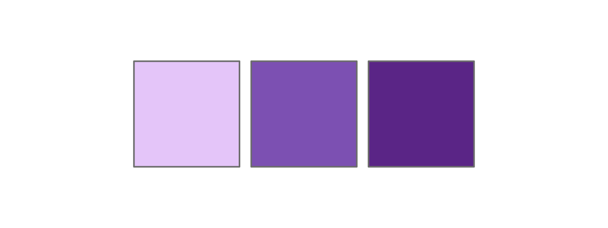



``` r
scales::show_col(colores)
```

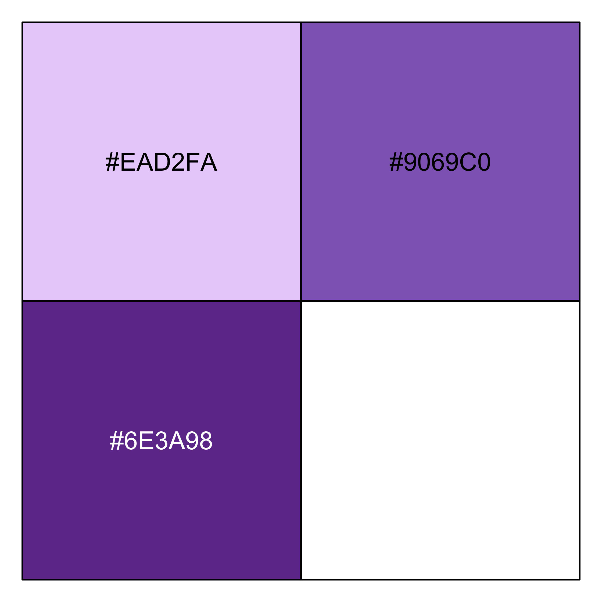



## Usar colores

La forma más básica de elegir un color en R es por su *nombre*.
Por defecto, en R **existen 657 colores** con nombre.

Aquí puedes ver los principales colores de R y copiar sus nombres para usarlos:

<span style="background-color: #FFFFFF ; color: black; border-radius: 4px; padding: 1px 4px; margin: 1px; line-height: 1.6; color: black">white</span>
<span style="background-color: #F0F8FF ; color: black; border-radius: 4px; padding: 1px 4px; margin: 1px; line-height: 1.6; color: black">aliceblue</span>
<span style="background-color: #FAEBD7 ; color: black; border-radius: 4px; padding: 1px 4px; margin: 1px; line-height: 1.6; color: black">antiquewhite</span>
<span style="background-color: #FFEFDB ; color: black; border-radius: 4px; padding: 1px 4px; margin: 1px; line-height: 1.6; color: black">antiquewhite1</span>
<span style="background-color: #EEDFCC ; color: black; border-radius: 4px; padding: 1px 4px; margin: 1px; line-height: 1.6; color: black">antiquewhite2</span>
<span style="background-color: #CDC0B0 ; color: black; border-radius: 4px; padding: 1px 4px; margin: 1px; line-height: 1.6; color: black">antiquewhite3</span>
<span style="background-color: #8B8378 ; color: black; border-radius: 4px; padding: 1px 4px; margin: 1px; line-height: 1.6; color: black">antiquewhite4</span>
<span style="background-color: #7FFFD4 ; color: black; border-radius: 4px; padding: 1px 4px; margin: 1px; line-height: 1.6; color: black">aquamarine</span>
<span style="background-color: #76EEC6 ; color: black; border-radius: 4px; padding: 1px 4px; margin: 1px; line-height: 1.6; color: black">aquamarine2</span>
<span style="background-color: #66CDAA ; color: black; border-radius: 4px; padding: 1px 4px; margin: 1px; line-height: 1.6; color: black">aquamarine3</span>
<span style="background-color: #458B74 ; color: black; border-radius: 4px; padding: 1px 4px; margin: 1px; line-height: 1.6; color: black">aquamarine4</span>
<span style="background-color: #F0FFFF ; color: black; border-radius: 4px; padding: 1px 4px; margin: 1px; line-height: 1.6; color: black">azure</span>
<span style="background-color: #E0EEEE ; color: black; border-radius: 4px; padding: 1px 4px; margin: 1px; line-height: 1.6; color: black">azure2</span>
<span style="background-color: #C1CDCD ; color: black; border-radius: 4px; padding: 1px 4px; margin: 1px; line-height: 1.6; color: black">azure3</span>
<span style="background-color: #838B8B ; color: black; border-radius: 4px; padding: 1px 4px; margin: 1px; line-height: 1.6; color: black">azure4</span>
<span style="background-color: #F5F5DC ; color: black; border-radius: 4px; padding: 1px 4px; margin: 1px; line-height: 1.6; color: black">beige</span>
<span style="background-color: #FFE4C4 ; color: black; border-radius: 4px; padding: 1px 4px; margin: 1px; line-height: 1.6; color: black">bisque</span>
<span style="background-color: #EED5B7 ; color: black; border-radius: 4px; padding: 1px 4px; margin: 1px; line-height: 1.6; color: black">bisque2</span>
<span style="background-color: #CDB79E ; color: black; border-radius: 4px; padding: 1px 4px; margin: 1px; line-height: 1.6; color: black">bisque3</span>
<span style="background-color: #8B7D6B ; color: black; border-radius: 4px; padding: 1px 4px; margin: 1px; line-height: 1.6; color: black">bisque4</span>
<span style="background-color: #000000 ; color: black; border-radius: 4px; padding: 1px 4px; margin: 1px; line-height: 1.6; color: white">black</span>
<span style="background-color: #FFEBCD ; color: black; border-radius: 4px; padding: 1px 4px; margin: 1px; line-height: 1.6; color: black">blanchedalmond</span>
<span style="background-color: #0000FF ; color: black; border-radius: 4px; padding: 1px 4px; margin: 1px; line-height: 1.6; color: white">blue</span>
<span style="background-color: #0000EE ; color: black; border-radius: 4px; padding: 1px 4px; margin: 1px; line-height: 1.6; color: white">blue2</span>
<span style="background-color: #0000CD ; color: black; border-radius: 4px; padding: 1px 4px; margin: 1px; line-height: 1.6; color: white">blue3</span>
<span style="background-color: #00008B ; color: black; border-radius: 4px; padding: 1px 4px; margin: 1px; line-height: 1.6; color: white">blue4</span>
<span style="background-color: #8A2BE2 ; color: black; border-radius: 4px; padding: 1px 4px; margin: 1px; line-height: 1.6; color: black">blueviolet</span>
<span style="background-color: #A52A2A ; color: black; border-radius: 4px; padding: 1px 4px; margin: 1px; line-height: 1.6; color: black">brown</span>
<span style="background-color: #FF4040 ; color: black; border-radius: 4px; padding: 1px 4px; margin: 1px; line-height: 1.6; color: black">brown1</span>
<span style="background-color: #EE3B3B ; color: black; border-radius: 4px; padding: 1px 4px; margin: 1px; line-height: 1.6; color: black">brown2</span>
<span style="background-color: #CD3333 ; color: black; border-radius: 4px; padding: 1px 4px; margin: 1px; line-height: 1.6; color: black">brown3</span>
<span style="background-color: #8B2323 ; color: black; border-radius: 4px; padding: 1px 4px; margin: 1px; line-height: 1.6; color: black">brown4</span>
<span style="background-color: #DEB887 ; color: black; border-radius: 4px; padding: 1px 4px; margin: 1px; line-height: 1.6; color: black">burlywood</span>
<span style="background-color: #FFD39B ; color: black; border-radius: 4px; padding: 1px 4px; margin: 1px; line-height: 1.6; color: black">burlywood1</span>
<span style="background-color: #EEC591 ; color: black; border-radius: 4px; padding: 1px 4px; margin: 1px; line-height: 1.6; color: black">burlywood2</span>
<span style="background-color: #CDAA7D ; color: black; border-radius: 4px; padding: 1px 4px; margin: 1px; line-height: 1.6; color: black">burlywood3</span>
<span style="background-color: #8B7355 ; color: black; border-radius: 4px; padding: 1px 4px; margin: 1px; line-height: 1.6; color: black">burlywood4</span>
<span style="background-color: #5F9EA0 ; color: black; border-radius: 4px; padding: 1px 4px; margin: 1px; line-height: 1.6; color: black">cadetblue</span>
<span style="background-color: #98F5FF ; color: black; border-radius: 4px; padding: 1px 4px; margin: 1px; line-height: 1.6; color: black">cadetblue1</span>
<span style="background-color: #8EE5EE ; color: black; border-radius: 4px; padding: 1px 4px; margin: 1px; line-height: 1.6; color: black">cadetblue2</span>
<span style="background-color: #7AC5CD ; color: black; border-radius: 4px; padding: 1px 4px; margin: 1px; line-height: 1.6; color: black">cadetblue3</span>
<span style="background-color: #53868B ; color: black; border-radius: 4px; padding: 1px 4px; margin: 1px; line-height: 1.6; color: black">cadetblue4</span>
<span style="background-color: #7FFF00 ; color: black; border-radius: 4px; padding: 1px 4px; margin: 1px; line-height: 1.6; color: black">chartreuse</span>
<span style="background-color: #76EE00 ; color: black; border-radius: 4px; padding: 1px 4px; margin: 1px; line-height: 1.6; color: black">chartreuse2</span>
<span style="background-color: #66CD00 ; color: black; border-radius: 4px; padding: 1px 4px; margin: 1px; line-height: 1.6; color: black">chartreuse3</span>
<span style="background-color: #458B00 ; color: black; border-radius: 4px; padding: 1px 4px; margin: 1px; line-height: 1.6; color: black">chartreuse4</span>
<span style="background-color: #D2691E ; color: black; border-radius: 4px; padding: 1px 4px; margin: 1px; line-height: 1.6; color: black">chocolate</span>
<span style="background-color: #FF7F24 ; color: black; border-radius: 4px; padding: 1px 4px; margin: 1px; line-height: 1.6; color: black">chocolate1</span>
<span style="background-color: #EE7621 ; color: black; border-radius: 4px; padding: 1px 4px; margin: 1px; line-height: 1.6; color: black">chocolate2</span>
<span style="background-color: #CD661D ; color: black; border-radius: 4px; padding: 1px 4px; margin: 1px; line-height: 1.6; color: black">chocolate3</span>
<span style="background-color: #8B4513 ; color: black; border-radius: 4px; padding: 1px 4px; margin: 1px; line-height: 1.6; color: black">chocolate4</span>
<span style="background-color: #FF7F50 ; color: black; border-radius: 4px; padding: 1px 4px; margin: 1px; line-height: 1.6; color: black">coral</span>
<span style="background-color: #FF7256 ; color: black; border-radius: 4px; padding: 1px 4px; margin: 1px; line-height: 1.6; color: black">coral1</span>
<span style="background-color: #EE6A50 ; color: black; border-radius: 4px; padding: 1px 4px; margin: 1px; line-height: 1.6; color: black">coral2</span>
<span style="background-color: #CD5B45 ; color: black; border-radius: 4px; padding: 1px 4px; margin: 1px; line-height: 1.6; color: black">coral3</span>
<span style="background-color: #8B3E2F ; color: black; border-radius: 4px; padding: 1px 4px; margin: 1px; line-height: 1.6; color: black">coral4</span>
<span style="background-color: #6495ED ; color: black; border-radius: 4px; padding: 1px 4px; margin: 1px; line-height: 1.6; color: black">cornflowerblue</span>
<span style="background-color: #FFF8DC ; color: black; border-radius: 4px; padding: 1px 4px; margin: 1px; line-height: 1.6; color: black">cornsilk</span>
<span style="background-color: #EEE8CD ; color: black; border-radius: 4px; padding: 1px 4px; margin: 1px; line-height: 1.6; color: black">cornsilk2</span>
<span style="background-color: #CDC8B1 ; color: black; border-radius: 4px; padding: 1px 4px; margin: 1px; line-height: 1.6; color: black">cornsilk3</span>
<span style="background-color: #8B8878 ; color: black; border-radius: 4px; padding: 1px 4px; margin: 1px; line-height: 1.6; color: black">cornsilk4</span>
<span style="background-color: #00FFFF ; color: black; border-radius: 4px; padding: 1px 4px; margin: 1px; line-height: 1.6; color: black">cyan</span>
<span style="background-color: #00EEEE ; color: black; border-radius: 4px; padding: 1px 4px; margin: 1px; line-height: 1.6; color: black">cyan2</span>
<span style="background-color: #00CDCD ; color: black; border-radius: 4px; padding: 1px 4px; margin: 1px; line-height: 1.6; color: black">cyan3</span>
<span style="background-color: #008B8B ; color: black; border-radius: 4px; padding: 1px 4px; margin: 1px; line-height: 1.6; color: black">cyan4</span>
<span style="background-color: #B8860B ; color: black; border-radius: 4px; padding: 1px 4px; margin: 1px; line-height: 1.6; color: black">darkgoldenrod</span>
<span style="background-color: #FFB90F ; color: black; border-radius: 4px; padding: 1px 4px; margin: 1px; line-height: 1.6; color: black">darkgoldenrod1</span>
<span style="background-color: #EEAD0E ; color: black; border-radius: 4px; padding: 1px 4px; margin: 1px; line-height: 1.6; color: black">darkgoldenrod2</span>
<span style="background-color: #CD950C ; color: black; border-radius: 4px; padding: 1px 4px; margin: 1px; line-height: 1.6; color: black">darkgoldenrod3</span>
<span style="background-color: #8B6508 ; color: black; border-radius: 4px; padding: 1px 4px; margin: 1px; line-height: 1.6; color: black">darkgoldenrod4</span>
<span style="background-color: #006400 ; color: black; border-radius: 4px; padding: 1px 4px; margin: 1px; line-height: 1.6; color: white">darkgreen</span>
<span style="background-color: #BDB76B ; color: black; border-radius: 4px; padding: 1px 4px; margin: 1px; line-height: 1.6; color: black">darkkhaki</span>
<span style="background-color: #8B008B ; color: black; border-radius: 4px; padding: 1px 4px; margin: 1px; line-height: 1.6; color: black">darkmagenta</span>
<span style="background-color: #556B2F ; color: black; border-radius: 4px; padding: 1px 4px; margin: 1px; line-height: 1.6; color: black">darkolivegreen</span>
<span style="background-color: #CAFF70 ; color: black; border-radius: 4px; padding: 1px 4px; margin: 1px; line-height: 1.6; color: black">darkolivegreen1</span>
<span style="background-color: #BCEE68 ; color: black; border-radius: 4px; padding: 1px 4px; margin: 1px; line-height: 1.6; color: black">darkolivegreen2</span>
<span style="background-color: #A2CD5A ; color: black; border-radius: 4px; padding: 1px 4px; margin: 1px; line-height: 1.6; color: black">darkolivegreen3</span>
<span style="background-color: #6E8B3D ; color: black; border-radius: 4px; padding: 1px 4px; margin: 1px; line-height: 1.6; color: black">darkolivegreen4</span>
<span style="background-color: #FF8C00 ; color: black; border-radius: 4px; padding: 1px 4px; margin: 1px; line-height: 1.6; color: black">darkorange</span>
<span style="background-color: #FF7F00 ; color: black; border-radius: 4px; padding: 1px 4px; margin: 1px; line-height: 1.6; color: black">darkorange1</span>
<span style="background-color: #EE7600 ; color: black; border-radius: 4px; padding: 1px 4px; margin: 1px; line-height: 1.6; color: black">darkorange2</span>
<span style="background-color: #CD6600 ; color: black; border-radius: 4px; padding: 1px 4px; margin: 1px; line-height: 1.6; color: black">darkorange3</span>
<span style="background-color: #8B4500 ; color: black; border-radius: 4px; padding: 1px 4px; margin: 1px; line-height: 1.6; color: black">darkorange4</span>
<span style="background-color: #9932CC ; color: black; border-radius: 4px; padding: 1px 4px; margin: 1px; line-height: 1.6; color: black">darkorchid</span>
<span style="background-color: #BF3EFF ; color: black; border-radius: 4px; padding: 1px 4px; margin: 1px; line-height: 1.6; color: black">darkorchid1</span>
<span style="background-color: #B23AEE ; color: black; border-radius: 4px; padding: 1px 4px; margin: 1px; line-height: 1.6; color: black">darkorchid2</span>
<span style="background-color: #9A32CD ; color: black; border-radius: 4px; padding: 1px 4px; margin: 1px; line-height: 1.6; color: black">darkorchid3</span>
<span style="background-color: #68228B ; color: black; border-radius: 4px; padding: 1px 4px; margin: 1px; line-height: 1.6; color: black">darkorchid4</span>
<span style="background-color: #8B0000 ; color: black; border-radius: 4px; padding: 1px 4px; margin: 1px; line-height: 1.6; color: white">darkred</span>
<span style="background-color: #E9967A ; color: black; border-radius: 4px; padding: 1px 4px; margin: 1px; line-height: 1.6; color: black">darksalmon</span>
<span style="background-color: #8FBC8F ; color: black; border-radius: 4px; padding: 1px 4px; margin: 1px; line-height: 1.6; color: black">darkseagreen</span>
<span style="background-color: #C1FFC1 ; color: black; border-radius: 4px; padding: 1px 4px; margin: 1px; line-height: 1.6; color: black">darkseagreen1</span>
<span style="background-color: #B4EEB4 ; color: black; border-radius: 4px; padding: 1px 4px; margin: 1px; line-height: 1.6; color: black">darkseagreen2</span>
<span style="background-color: #9BCD9B ; color: black; border-radius: 4px; padding: 1px 4px; margin: 1px; line-height: 1.6; color: black">darkseagreen3</span>
<span style="background-color: #698B69 ; color: black; border-radius: 4px; padding: 1px 4px; margin: 1px; line-height: 1.6; color: black">darkseagreen4</span>
<span style="background-color: #483D8B ; color: black; border-radius: 4px; padding: 1px 4px; margin: 1px; line-height: 1.6; color: black">darkslateblue</span>
<span style="background-color: #00CED1 ; color: black; border-radius: 4px; padding: 1px 4px; margin: 1px; line-height: 1.6; color: black">darkturquoise</span>
<span style="background-color: #9400D3 ; color: black; border-radius: 4px; padding: 1px 4px; margin: 1px; line-height: 1.6; color: black">darkviolet</span>
<span style="background-color: #FF1493 ; color: black; border-radius: 4px; padding: 1px 4px; margin: 1px; line-height: 1.6; color: black">deeppink</span>
<span style="background-color: #EE1289 ; color: black; border-radius: 4px; padding: 1px 4px; margin: 1px; line-height: 1.6; color: black">deeppink2</span>
<span style="background-color: #CD1076 ; color: black; border-radius: 4px; padding: 1px 4px; margin: 1px; line-height: 1.6; color: black">deeppink3</span>
<span style="background-color: #8B0A50 ; color: black; border-radius: 4px; padding: 1px 4px; margin: 1px; line-height: 1.6; color: white">deeppink4</span>
<span style="background-color: #00BFFF ; color: black; border-radius: 4px; padding: 1px 4px; margin: 1px; line-height: 1.6; color: black">deepskyblue</span>
<span style="background-color: #00B2EE ; color: black; border-radius: 4px; padding: 1px 4px; margin: 1px; line-height: 1.6; color: black">deepskyblue2</span>
<span style="background-color: #009ACD ; color: black; border-radius: 4px; padding: 1px 4px; margin: 1px; line-height: 1.6; color: black">deepskyblue3</span>
<span style="background-color: #00688B ; color: black; border-radius: 4px; padding: 1px 4px; margin: 1px; line-height: 1.6; color: black">deepskyblue4</span>
<span style="background-color: #1E90FF ; color: black; border-radius: 4px; padding: 1px 4px; margin: 1px; line-height: 1.6; color: black">dodgerblue</span>
<span style="background-color: #1C86EE ; color: black; border-radius: 4px; padding: 1px 4px; margin: 1px; line-height: 1.6; color: black">dodgerblue2</span>
<span style="background-color: #1874CD ; color: black; border-radius: 4px; padding: 1px 4px; margin: 1px; line-height: 1.6; color: black">dodgerblue3</span>
<span style="background-color: #104E8B ; color: black; border-radius: 4px; padding: 1px 4px; margin: 1px; line-height: 1.6; color: black">dodgerblue4</span>
<span style="background-color: #B22222 ; color: black; border-radius: 4px; padding: 1px 4px; margin: 1px; line-height: 1.6; color: black">firebrick</span>
<span style="background-color: #FF3030 ; color: black; border-radius: 4px; padding: 1px 4px; margin: 1px; line-height: 1.6; color: black">firebrick1</span>
<span style="background-color: #EE2C2C ; color: black; border-radius: 4px; padding: 1px 4px; margin: 1px; line-height: 1.6; color: black">firebrick2</span>
<span style="background-color: #CD2626 ; color: black; border-radius: 4px; padding: 1px 4px; margin: 1px; line-height: 1.6; color: black">firebrick3</span>
<span style="background-color: #8B1A1A ; color: black; border-radius: 4px; padding: 1px 4px; margin: 1px; line-height: 1.6; color: white">firebrick4</span>
<span style="background-color: #FFFAF0 ; color: black; border-radius: 4px; padding: 1px 4px; margin: 1px; line-height: 1.6; color: black">floralwhite</span>
<span style="background-color: #228B22 ; color: black; border-radius: 4px; padding: 1px 4px; margin: 1px; line-height: 1.6; color: black">forestgreen</span>
<span style="background-color: #DCDCDC ; color: black; border-radius: 4px; padding: 1px 4px; margin: 1px; line-height: 1.6; color: black">gainsboro</span>
<span style="background-color: #F8F8FF ; color: black; border-radius: 4px; padding: 1px 4px; margin: 1px; line-height: 1.6; color: black">ghostwhite</span>
<span style="background-color: #FFD700 ; color: black; border-radius: 4px; padding: 1px 4px; margin: 1px; line-height: 1.6; color: black">gold</span>
<span style="background-color: #EEC900 ; color: black; border-radius: 4px; padding: 1px 4px; margin: 1px; line-height: 1.6; color: black">gold2</span>
<span style="background-color: #CDAD00 ; color: black; border-radius: 4px; padding: 1px 4px; margin: 1px; line-height: 1.6; color: black">gold3</span>
<span style="background-color: #8B7500 ; color: black; border-radius: 4px; padding: 1px 4px; margin: 1px; line-height: 1.6; color: black">gold4</span>
<span style="background-color: #DAA520 ; color: black; border-radius: 4px; padding: 1px 4px; margin: 1px; line-height: 1.6; color: black">goldenrod</span>
<span style="background-color: #FFC125 ; color: black; border-radius: 4px; padding: 1px 4px; margin: 1px; line-height: 1.6; color: black">goldenrod1</span>
<span style="background-color: #EEB422 ; color: black; border-radius: 4px; padding: 1px 4px; margin: 1px; line-height: 1.6; color: black">goldenrod2</span>
<span style="background-color: #CD9B1D ; color: black; border-radius: 4px; padding: 1px 4px; margin: 1px; line-height: 1.6; color: black">goldenrod3</span>
<span style="background-color: #8B6914 ; color: black; border-radius: 4px; padding: 1px 4px; margin: 1px; line-height: 1.6; color: black">goldenrod4</span>
<span style="background-color: #00FF00 ; color: black; border-radius: 4px; padding: 1px 4px; margin: 1px; line-height: 1.6; color: black">green</span>
<span style="background-color: #00EE00 ; color: black; border-radius: 4px; padding: 1px 4px; margin: 1px; line-height: 1.6; color: black">green2</span>
<span style="background-color: #00CD00 ; color: black; border-radius: 4px; padding: 1px 4px; margin: 1px; line-height: 1.6; color: black">green3</span>
<span style="background-color: #008B00 ; color: black; border-radius: 4px; padding: 1px 4px; margin: 1px; line-height: 1.6; color: black">green4</span>
<span style="background-color: #ADFF2F ; color: black; border-radius: 4px; padding: 1px 4px; margin: 1px; line-height: 1.6; color: black">greenyellow</span>
<span style="background-color: #F0FFF0 ; color: black; border-radius: 4px; padding: 1px 4px; margin: 1px; line-height: 1.6; color: black">honeydew</span>
<span style="background-color: #E0EEE0 ; color: black; border-radius: 4px; padding: 1px 4px; margin: 1px; line-height: 1.6; color: black">honeydew2</span>
<span style="background-color: #C1CDC1 ; color: black; border-radius: 4px; padding: 1px 4px; margin: 1px; line-height: 1.6; color: black">honeydew3</span>
<span style="background-color: #838B83 ; color: black; border-radius: 4px; padding: 1px 4px; margin: 1px; line-height: 1.6; color: black">honeydew4</span>
<span style="background-color: #FF69B4 ; color: black; border-radius: 4px; padding: 1px 4px; margin: 1px; line-height: 1.6; color: black">hotpink</span>
<span style="background-color: #FF6EB4 ; color: black; border-radius: 4px; padding: 1px 4px; margin: 1px; line-height: 1.6; color: black">hotpink1</span>
<span style="background-color: #EE6AA7 ; color: black; border-radius: 4px; padding: 1px 4px; margin: 1px; line-height: 1.6; color: black">hotpink2</span>
<span style="background-color: #CD6090 ; color: black; border-radius: 4px; padding: 1px 4px; margin: 1px; line-height: 1.6; color: black">hotpink3</span>
<span style="background-color: #8B3A62 ; color: black; border-radius: 4px; padding: 1px 4px; margin: 1px; line-height: 1.6; color: black">hotpink4</span>
<span style="background-color: #CD5C5C ; color: black; border-radius: 4px; padding: 1px 4px; margin: 1px; line-height: 1.6; color: black">indianred</span>
<span style="background-color: #FF6A6A ; color: black; border-radius: 4px; padding: 1px 4px; margin: 1px; line-height: 1.6; color: black">indianred1</span>
<span style="background-color: #EE6363 ; color: black; border-radius: 4px; padding: 1px 4px; margin: 1px; line-height: 1.6; color: black">indianred2</span>
<span style="background-color: #CD5555 ; color: black; border-radius: 4px; padding: 1px 4px; margin: 1px; line-height: 1.6; color: black">indianred3</span>
<span style="background-color: #8B3A3A ; color: black; border-radius: 4px; padding: 1px 4px; margin: 1px; line-height: 1.6; color: white">indianred4</span>
<span style="background-color: #FFFFF0 ; color: black; border-radius: 4px; padding: 1px 4px; margin: 1px; line-height: 1.6; color: black">ivory</span>
<span style="background-color: #EEEEE0 ; color: black; border-radius: 4px; padding: 1px 4px; margin: 1px; line-height: 1.6; color: black">ivory2</span>
<span style="background-color: #CDCDC1 ; color: black; border-radius: 4px; padding: 1px 4px; margin: 1px; line-height: 1.6; color: black">ivory3</span>
<span style="background-color: #8B8B83 ; color: black; border-radius: 4px; padding: 1px 4px; margin: 1px; line-height: 1.6; color: black">ivory4</span>
<span style="background-color: #F0E68C ; color: black; border-radius: 4px; padding: 1px 4px; margin: 1px; line-height: 1.6; color: black">khaki</span>
<span style="background-color: #FFF68F ; color: black; border-radius: 4px; padding: 1px 4px; margin: 1px; line-height: 1.6; color: black">khaki1</span>
<span style="background-color: #EEE685 ; color: black; border-radius: 4px; padding: 1px 4px; margin: 1px; line-height: 1.6; color: black">khaki2</span>
<span style="background-color: #CDC673 ; color: black; border-radius: 4px; padding: 1px 4px; margin: 1px; line-height: 1.6; color: black">khaki3</span>
<span style="background-color: #8B864E ; color: black; border-radius: 4px; padding: 1px 4px; margin: 1px; line-height: 1.6; color: black">khaki4</span>
<span style="background-color: #E6E6FA ; color: black; border-radius: 4px; padding: 1px 4px; margin: 1px; line-height: 1.6; color: black">lavender</span>
<span style="background-color: #FFF0F5 ; color: black; border-radius: 4px; padding: 1px 4px; margin: 1px; line-height: 1.6; color: black">lavenderblush</span>
<span style="background-color: #EEE0E5 ; color: black; border-radius: 4px; padding: 1px 4px; margin: 1px; line-height: 1.6; color: black">lavenderblush2</span>
<span style="background-color: #CDC1C5 ; color: black; border-radius: 4px; padding: 1px 4px; margin: 1px; line-height: 1.6; color: black">lavenderblush3</span>
<span style="background-color: #8B8386 ; color: black; border-radius: 4px; padding: 1px 4px; margin: 1px; line-height: 1.6; color: black">lavenderblush4</span>
<span style="background-color: #7CFC00 ; color: black; border-radius: 4px; padding: 1px 4px; margin: 1px; line-height: 1.6; color: black">lawngreen</span>
<span style="background-color: #FFFACD ; color: black; border-radius: 4px; padding: 1px 4px; margin: 1px; line-height: 1.6; color: black">lemonchiffon</span>
<span style="background-color: #EEE9BF ; color: black; border-radius: 4px; padding: 1px 4px; margin: 1px; line-height: 1.6; color: black">lemonchiffon2</span>
<span style="background-color: #CDC9A5 ; color: black; border-radius: 4px; padding: 1px 4px; margin: 1px; line-height: 1.6; color: black">lemonchiffon3</span>
<span style="background-color: #8B8970 ; color: black; border-radius: 4px; padding: 1px 4px; margin: 1px; line-height: 1.6; color: black">lemonchiffon4</span>
<span style="background-color: #ADD8E6 ; color: black; border-radius: 4px; padding: 1px 4px; margin: 1px; line-height: 1.6; color: black">lightblue</span>
<span style="background-color: #BFEFFF ; color: black; border-radius: 4px; padding: 1px 4px; margin: 1px; line-height: 1.6; color: black">lightblue1</span>
<span style="background-color: #B2DFEE ; color: black; border-radius: 4px; padding: 1px 4px; margin: 1px; line-height: 1.6; color: black">lightblue2</span>
<span style="background-color: #9AC0CD ; color: black; border-radius: 4px; padding: 1px 4px; margin: 1px; line-height: 1.6; color: black">lightblue3</span>
<span style="background-color: #68838B ; color: black; border-radius: 4px; padding: 1px 4px; margin: 1px; line-height: 1.6; color: black">lightblue4</span>
<span style="background-color: #F08080 ; color: black; border-radius: 4px; padding: 1px 4px; margin: 1px; line-height: 1.6; color: black">lightcoral</span>
<span style="background-color: #E0FFFF ; color: black; border-radius: 4px; padding: 1px 4px; margin: 1px; line-height: 1.6; color: black">lightcyan</span>
<span style="background-color: #D1EEEE ; color: black; border-radius: 4px; padding: 1px 4px; margin: 1px; line-height: 1.6; color: black">lightcyan2</span>
<span style="background-color: #B4CDCD ; color: black; border-radius: 4px; padding: 1px 4px; margin: 1px; line-height: 1.6; color: black">lightcyan3</span>
<span style="background-color: #7A8B8B ; color: black; border-radius: 4px; padding: 1px 4px; margin: 1px; line-height: 1.6; color: black">lightcyan4</span>
<span style="background-color: #EEDD82 ; color: black; border-radius: 4px; padding: 1px 4px; margin: 1px; line-height: 1.6; color: black">lightgoldenrod</span>
<span style="background-color: #FFEC8B ; color: black; border-radius: 4px; padding: 1px 4px; margin: 1px; line-height: 1.6; color: black">lightgoldenrod1</span>
<span style="background-color: #EEDC82 ; color: black; border-radius: 4px; padding: 1px 4px; margin: 1px; line-height: 1.6; color: black">lightgoldenrod2</span>
<span style="background-color: #CDBE70 ; color: black; border-radius: 4px; padding: 1px 4px; margin: 1px; line-height: 1.6; color: black">lightgoldenrod3</span>
<span style="background-color: #8B814C ; color: black; border-radius: 4px; padding: 1px 4px; margin: 1px; line-height: 1.6; color: black">lightgoldenrod4</span>
<span style="background-color: #FAFAD2 ; color: black; border-radius: 4px; padding: 1px 4px; margin: 1px; line-height: 1.6; color: black">lightgoldenrodyellow</span>
<span style="background-color: #90EE90 ; color: black; border-radius: 4px; padding: 1px 4px; margin: 1px; line-height: 1.6; color: black">lightgreen</span>
<span style="background-color: #FFB6C1 ; color: black; border-radius: 4px; padding: 1px 4px; margin: 1px; line-height: 1.6; color: black">lightpink</span>
<span style="background-color: #FFAEB9 ; color: black; border-radius: 4px; padding: 1px 4px; margin: 1px; line-height: 1.6; color: black">lightpink1</span>
<span style="background-color: #EEA2AD ; color: black; border-radius: 4px; padding: 1px 4px; margin: 1px; line-height: 1.6; color: black">lightpink2</span>
<span style="background-color: #CD8C95 ; color: black; border-radius: 4px; padding: 1px 4px; margin: 1px; line-height: 1.6; color: black">lightpink3</span>
<span style="background-color: #8B5F65 ; color: black; border-radius: 4px; padding: 1px 4px; margin: 1px; line-height: 1.6; color: black">lightpink4</span>
<span style="background-color: #FFA07A ; color: black; border-radius: 4px; padding: 1px 4px; margin: 1px; line-height: 1.6; color: black">lightsalmon</span>
<span style="background-color: #EE9572 ; color: black; border-radius: 4px; padding: 1px 4px; margin: 1px; line-height: 1.6; color: black">lightsalmon2</span>
<span style="background-color: #CD8162 ; color: black; border-radius: 4px; padding: 1px 4px; margin: 1px; line-height: 1.6; color: black">lightsalmon3</span>
<span style="background-color: #8B5742 ; color: black; border-radius: 4px; padding: 1px 4px; margin: 1px; line-height: 1.6; color: black">lightsalmon4</span>
<span style="background-color: #20B2AA ; color: black; border-radius: 4px; padding: 1px 4px; margin: 1px; line-height: 1.6; color: black">lightseagreen</span>
<span style="background-color: #87CEFA ; color: black; border-radius: 4px; padding: 1px 4px; margin: 1px; line-height: 1.6; color: black">lightskyblue</span>
<span style="background-color: #B0E2FF ; color: black; border-radius: 4px; padding: 1px 4px; margin: 1px; line-height: 1.6; color: black">lightskyblue1</span>
<span style="background-color: #A4D3EE ; color: black; border-radius: 4px; padding: 1px 4px; margin: 1px; line-height: 1.6; color: black">lightskyblue2</span>
<span style="background-color: #8DB6CD ; color: black; border-radius: 4px; padding: 1px 4px; margin: 1px; line-height: 1.6; color: black">lightskyblue3</span>
<span style="background-color: #607B8B ; color: black; border-radius: 4px; padding: 1px 4px; margin: 1px; line-height: 1.6; color: black">lightskyblue4</span>
<span style="background-color: #8470FF ; color: black; border-radius: 4px; padding: 1px 4px; margin: 1px; line-height: 1.6; color: black">lightslateblue</span>
<span style="background-color: #B0C4DE ; color: black; border-radius: 4px; padding: 1px 4px; margin: 1px; line-height: 1.6; color: black">lightsteelblue</span>
<span style="background-color: #CAE1FF ; color: black; border-radius: 4px; padding: 1px 4px; margin: 1px; line-height: 1.6; color: black">lightsteelblue1</span>
<span style="background-color: #BCD2EE ; color: black; border-radius: 4px; padding: 1px 4px; margin: 1px; line-height: 1.6; color: black">lightsteelblue2</span>
<span style="background-color: #A2B5CD ; color: black; border-radius: 4px; padding: 1px 4px; margin: 1px; line-height: 1.6; color: black">lightsteelblue3</span>
<span style="background-color: #6E7B8B ; color: black; border-radius: 4px; padding: 1px 4px; margin: 1px; line-height: 1.6; color: black">lightsteelblue4</span>
<span style="background-color: #FFFFE0 ; color: black; border-radius: 4px; padding: 1px 4px; margin: 1px; line-height: 1.6; color: black">lightyellow</span>
<span style="background-color: #EEEED1 ; color: black; border-radius: 4px; padding: 1px 4px; margin: 1px; line-height: 1.6; color: black">lightyellow2</span>
<span style="background-color: #CDCDB4 ; color: black; border-radius: 4px; padding: 1px 4px; margin: 1px; line-height: 1.6; color: black">lightyellow3</span>
<span style="background-color: #8B8B7A ; color: black; border-radius: 4px; padding: 1px 4px; margin: 1px; line-height: 1.6; color: black">lightyellow4</span>
<span style="background-color: #32CD32 ; color: black; border-radius: 4px; padding: 1px 4px; margin: 1px; line-height: 1.6; color: black">limegreen</span>
<span style="background-color: #FAF0E6 ; color: black; border-radius: 4px; padding: 1px 4px; margin: 1px; line-height: 1.6; color: black">linen</span>
<span style="background-color: #FF00FF ; color: black; border-radius: 4px; padding: 1px 4px; margin: 1px; line-height: 1.6; color: black">magenta</span>
<span style="background-color: #EE00EE ; color: black; border-radius: 4px; padding: 1px 4px; margin: 1px; line-height: 1.6; color: black">magenta2</span>
<span style="background-color: #CD00CD ; color: black; border-radius: 4px; padding: 1px 4px; margin: 1px; line-height: 1.6; color: black">magenta3</span>
<span style="background-color: #B03060 ; color: black; border-radius: 4px; padding: 1px 4px; margin: 1px; line-height: 1.6; color: black">maroon</span>
<span style="background-color: #FF34B3 ; color: black; border-radius: 4px; padding: 1px 4px; margin: 1px; line-height: 1.6; color: black">maroon1</span>
<span style="background-color: #EE30A7 ; color: black; border-radius: 4px; padding: 1px 4px; margin: 1px; line-height: 1.6; color: black">maroon2</span>
<span style="background-color: #CD2990 ; color: black; border-radius: 4px; padding: 1px 4px; margin: 1px; line-height: 1.6; color: black">maroon3</span>
<span style="background-color: #8B1C62 ; color: black; border-radius: 4px; padding: 1px 4px; margin: 1px; line-height: 1.6; color: white">maroon4</span>
<span style="background-color: #BA55D3 ; color: black; border-radius: 4px; padding: 1px 4px; margin: 1px; line-height: 1.6; color: black">mediumorchid</span>
<span style="background-color: #E066FF ; color: black; border-radius: 4px; padding: 1px 4px; margin: 1px; line-height: 1.6; color: black">mediumorchid1</span>
<span style="background-color: #D15FEE ; color: black; border-radius: 4px; padding: 1px 4px; margin: 1px; line-height: 1.6; color: black">mediumorchid2</span>
<span style="background-color: #B452CD ; color: black; border-radius: 4px; padding: 1px 4px; margin: 1px; line-height: 1.6; color: black">mediumorchid3</span>
<span style="background-color: #7A378B ; color: black; border-radius: 4px; padding: 1px 4px; margin: 1px; line-height: 1.6; color: black">mediumorchid4</span>
<span style="background-color: #9370DB ; color: black; border-radius: 4px; padding: 1px 4px; margin: 1px; line-height: 1.6; color: black">mediumpurple</span>
<span style="background-color: #AB82FF ; color: black; border-radius: 4px; padding: 1px 4px; margin: 1px; line-height: 1.6; color: black">mediumpurple1</span>
<span style="background-color: #9F79EE ; color: black; border-radius: 4px; padding: 1px 4px; margin: 1px; line-height: 1.6; color: black">mediumpurple2</span>
<span style="background-color: #8968CD ; color: black; border-radius: 4px; padding: 1px 4px; margin: 1px; line-height: 1.6; color: black">mediumpurple3</span>
<span style="background-color: #5D478B ; color: black; border-radius: 4px; padding: 1px 4px; margin: 1px; line-height: 1.6; color: white">mediumpurple4</span>
<span style="background-color: #3CB371 ; color: black; border-radius: 4px; padding: 1px 4px; margin: 1px; line-height: 1.6; color: black">mediumseagreen</span>
<span style="background-color: #7B68EE ; color: black; border-radius: 4px; padding: 1px 4px; margin: 1px; line-height: 1.6; color: black">mediumslateblue</span>
<span style="background-color: #00FA9A ; color: black; border-radius: 4px; padding: 1px 4px; margin: 1px; line-height: 1.6; color: black">mediumspringgreen</span>
<span style="background-color: #48D1CC ; color: black; border-radius: 4px; padding: 1px 4px; margin: 1px; line-height: 1.6; color: black">mediumturquoise</span>
<span style="background-color: #C71585 ; color: black; border-radius: 4px; padding: 1px 4px; margin: 1px; line-height: 1.6; color: black">mediumvioletred</span>
<span style="background-color: #191970 ; color: black; border-radius: 4px; padding: 1px 4px; margin: 1px; line-height: 1.6; color: white">midnightblue</span>
<span style="background-color: #F5FFFA ; color: black; border-radius: 4px; padding: 1px 4px; margin: 1px; line-height: 1.6; color: black">mintcream</span>
<span style="background-color: #FFE4E1 ; color: black; border-radius: 4px; padding: 1px 4px; margin: 1px; line-height: 1.6; color: black">mistyrose</span>
<span style="background-color: #EED5D2 ; color: black; border-radius: 4px; padding: 1px 4px; margin: 1px; line-height: 1.6; color: black">mistyrose2</span>
<span style="background-color: #CDB7B5 ; color: black; border-radius: 4px; padding: 1px 4px; margin: 1px; line-height: 1.6; color: black">mistyrose3</span>
<span style="background-color: #8B7D7B ; color: black; border-radius: 4px; padding: 1px 4px; margin: 1px; line-height: 1.6; color: black">mistyrose4</span>
<span style="background-color: #FFE4B5 ; color: black; border-radius: 4px; padding: 1px 4px; margin: 1px; line-height: 1.6; color: black">moccasin</span>
<span style="background-color: #FFDEAD ; color: black; border-radius: 4px; padding: 1px 4px; margin: 1px; line-height: 1.6; color: black">navajowhite</span>
<span style="background-color: #EECFA1 ; color: black; border-radius: 4px; padding: 1px 4px; margin: 1px; line-height: 1.6; color: black">navajowhite2</span>
<span style="background-color: #CDB38B ; color: black; border-radius: 4px; padding: 1px 4px; margin: 1px; line-height: 1.6; color: black">navajowhite3</span>
<span style="background-color: #8B795E ; color: black; border-radius: 4px; padding: 1px 4px; margin: 1px; line-height: 1.6; color: black">navajowhite4</span>
<span style="background-color: #000080 ; color: black; border-radius: 4px; padding: 1px 4px; margin: 1px; line-height: 1.6; color: white">navy</span>
<span style="background-color: #FDF5E6 ; color: black; border-radius: 4px; padding: 1px 4px; margin: 1px; line-height: 1.6; color: black">oldlace</span>
<span style="background-color: #6B8E23 ; color: black; border-radius: 4px; padding: 1px 4px; margin: 1px; line-height: 1.6; color: black">olivedrab</span>
<span style="background-color: #C0FF3E ; color: black; border-radius: 4px; padding: 1px 4px; margin: 1px; line-height: 1.6; color: black">olivedrab1</span>
<span style="background-color: #B3EE3A ; color: black; border-radius: 4px; padding: 1px 4px; margin: 1px; line-height: 1.6; color: black">olivedrab2</span>
<span style="background-color: #9ACD32 ; color: black; border-radius: 4px; padding: 1px 4px; margin: 1px; line-height: 1.6; color: black">olivedrab3</span>
<span style="background-color: #698B22 ; color: black; border-radius: 4px; padding: 1px 4px; margin: 1px; line-height: 1.6; color: black">olivedrab4</span>
<span style="background-color: #FFA500 ; color: black; border-radius: 4px; padding: 1px 4px; margin: 1px; line-height: 1.6; color: black">orange</span>
<span style="background-color: #EE9A00 ; color: black; border-radius: 4px; padding: 1px 4px; margin: 1px; line-height: 1.6; color: black">orange2</span>
<span style="background-color: #CD8500 ; color: black; border-radius: 4px; padding: 1px 4px; margin: 1px; line-height: 1.6; color: black">orange3</span>
<span style="background-color: #8B5A00 ; color: black; border-radius: 4px; padding: 1px 4px; margin: 1px; line-height: 1.6; color: black">orange4</span>
<span style="background-color: #FF4500 ; color: black; border-radius: 4px; padding: 1px 4px; margin: 1px; line-height: 1.6; color: black">orangered</span>
<span style="background-color: #EE4000 ; color: black; border-radius: 4px; padding: 1px 4px; margin: 1px; line-height: 1.6; color: black">orangered2</span>
<span style="background-color: #CD3700 ; color: black; border-radius: 4px; padding: 1px 4px; margin: 1px; line-height: 1.6; color: black">orangered3</span>
<span style="background-color: #8B2500 ; color: black; border-radius: 4px; padding: 1px 4px; margin: 1px; line-height: 1.6; color: white">orangered4</span>
<span style="background-color: #DA70D6 ; color: black; border-radius: 4px; padding: 1px 4px; margin: 1px; line-height: 1.6; color: black">orchid</span>
<span style="background-color: #FF83FA ; color: black; border-radius: 4px; padding: 1px 4px; margin: 1px; line-height: 1.6; color: black">orchid1</span>
<span style="background-color: #EE7AE9 ; color: black; border-radius: 4px; padding: 1px 4px; margin: 1px; line-height: 1.6; color: black">orchid2</span>
<span style="background-color: #CD69C9 ; color: black; border-radius: 4px; padding: 1px 4px; margin: 1px; line-height: 1.6; color: black">orchid3</span>
<span style="background-color: #8B4789 ; color: black; border-radius: 4px; padding: 1px 4px; margin: 1px; line-height: 1.6; color: black">orchid4</span>
<span style="background-color: #EEE8AA ; color: black; border-radius: 4px; padding: 1px 4px; margin: 1px; line-height: 1.6; color: black">palegoldenrod</span>
<span style="background-color: #98FB98 ; color: black; border-radius: 4px; padding: 1px 4px; margin: 1px; line-height: 1.6; color: black">palegreen</span>
<span style="background-color: #9AFF9A ; color: black; border-radius: 4px; padding: 1px 4px; margin: 1px; line-height: 1.6; color: black">palegreen1</span>
<span style="background-color: #7CCD7C ; color: black; border-radius: 4px; padding: 1px 4px; margin: 1px; line-height: 1.6; color: black">palegreen3</span>
<span style="background-color: #548B54 ; color: black; border-radius: 4px; padding: 1px 4px; margin: 1px; line-height: 1.6; color: black">palegreen4</span>
<span style="background-color: #AFEEEE ; color: black; border-radius: 4px; padding: 1px 4px; margin: 1px; line-height: 1.6; color: black">paleturquoise</span>
<span style="background-color: #BBFFFF ; color: black; border-radius: 4px; padding: 1px 4px; margin: 1px; line-height: 1.6; color: black">paleturquoise1</span>
<span style="background-color: #AEEEEE ; color: black; border-radius: 4px; padding: 1px 4px; margin: 1px; line-height: 1.6; color: black">paleturquoise2</span>
<span style="background-color: #96CDCD ; color: black; border-radius: 4px; padding: 1px 4px; margin: 1px; line-height: 1.6; color: black">paleturquoise3</span>
<span style="background-color: #668B8B ; color: black; border-radius: 4px; padding: 1px 4px; margin: 1px; line-height: 1.6; color: black">paleturquoise4</span>
<span style="background-color: #DB7093 ; color: black; border-radius: 4px; padding: 1px 4px; margin: 1px; line-height: 1.6; color: black">palevioletred</span>
<span style="background-color: #FF82AB ; color: black; border-radius: 4px; padding: 1px 4px; margin: 1px; line-height: 1.6; color: black">palevioletred1</span>
<span style="background-color: #EE799F ; color: black; border-radius: 4px; padding: 1px 4px; margin: 1px; line-height: 1.6; color: black">palevioletred2</span>
<span style="background-color: #CD6889 ; color: black; border-radius: 4px; padding: 1px 4px; margin: 1px; line-height: 1.6; color: black">palevioletred3</span>
<span style="background-color: #8B475D ; color: black; border-radius: 4px; padding: 1px 4px; margin: 1px; line-height: 1.6; color: black">palevioletred4</span>
<span style="background-color: #FFEFD5 ; color: black; border-radius: 4px; padding: 1px 4px; margin: 1px; line-height: 1.6; color: black">papayawhip</span>
<span style="background-color: #FFDAB9 ; color: black; border-radius: 4px; padding: 1px 4px; margin: 1px; line-height: 1.6; color: black">peachpuff</span>
<span style="background-color: #EECBAD ; color: black; border-radius: 4px; padding: 1px 4px; margin: 1px; line-height: 1.6; color: black">peachpuff2</span>
<span style="background-color: #CDAF95 ; color: black; border-radius: 4px; padding: 1px 4px; margin: 1px; line-height: 1.6; color: black">peachpuff3</span>
<span style="background-color: #8B7765 ; color: black; border-radius: 4px; padding: 1px 4px; margin: 1px; line-height: 1.6; color: black">peachpuff4</span>
<span style="background-color: #CD853F ; color: black; border-radius: 4px; padding: 1px 4px; margin: 1px; line-height: 1.6; color: black">peru</span>
<span style="background-color: #FFC0CB ; color: black; border-radius: 4px; padding: 1px 4px; margin: 1px; line-height: 1.6; color: black">pink</span>
<span style="background-color: #FFB5C5 ; color: black; border-radius: 4px; padding: 1px 4px; margin: 1px; line-height: 1.6; color: black">pink1</span>
<span style="background-color: #EEA9B8 ; color: black; border-radius: 4px; padding: 1px 4px; margin: 1px; line-height: 1.6; color: black">pink2</span>
<span style="background-color: #CD919E ; color: black; border-radius: 4px; padding: 1px 4px; margin: 1px; line-height: 1.6; color: black">pink3</span>
<span style="background-color: #8B636C ; color: black; border-radius: 4px; padding: 1px 4px; margin: 1px; line-height: 1.6; color: black">pink4</span>
<span style="background-color: #DDA0DD ; color: black; border-radius: 4px; padding: 1px 4px; margin: 1px; line-height: 1.6; color: black">plum</span>
<span style="background-color: #FFBBFF ; color: black; border-radius: 4px; padding: 1px 4px; margin: 1px; line-height: 1.6; color: black">plum1</span>
<span style="background-color: #EEAEEE ; color: black; border-radius: 4px; padding: 1px 4px; margin: 1px; line-height: 1.6; color: black">plum2</span>
<span style="background-color: #CD96CD ; color: black; border-radius: 4px; padding: 1px 4px; margin: 1px; line-height: 1.6; color: black">plum3</span>
<span style="background-color: #8B668B ; color: black; border-radius: 4px; padding: 1px 4px; margin: 1px; line-height: 1.6; color: black">plum4</span>
<span style="background-color: #B0E0E6 ; color: black; border-radius: 4px; padding: 1px 4px; margin: 1px; line-height: 1.6; color: black">powderblue</span>
<span style="background-color: #A020F0 ; color: black; border-radius: 4px; padding: 1px 4px; margin: 1px; line-height: 1.6; color: black">purple</span>
<span style="background-color: #9B30FF ; color: black; border-radius: 4px; padding: 1px 4px; margin: 1px; line-height: 1.6; color: black">purple1</span>
<span style="background-color: #912CEE ; color: black; border-radius: 4px; padding: 1px 4px; margin: 1px; line-height: 1.6; color: black">purple2</span>
<span style="background-color: #7D26CD ; color: black; border-radius: 4px; padding: 1px 4px; margin: 1px; line-height: 1.6; color: black">purple3</span>
<span style="background-color: #551A8B ; color: black; border-radius: 4px; padding: 1px 4px; margin: 1px; line-height: 1.6; color: white">purple4</span>
<span style="background-color: #FF0000 ; color: black; border-radius: 4px; padding: 1px 4px; margin: 1px; line-height: 1.6; color: black">red</span>
<span style="background-color: #EE0000 ; color: black; border-radius: 4px; padding: 1px 4px; margin: 1px; line-height: 1.6; color: black">red2</span>
<span style="background-color: #CD0000 ; color: black; border-radius: 4px; padding: 1px 4px; margin: 1px; line-height: 1.6; color: black">red3</span>
<span style="background-color: #BC8F8F ; color: black; border-radius: 4px; padding: 1px 4px; margin: 1px; line-height: 1.6; color: black">rosybrown</span>
<span style="background-color: #FFC1C1 ; color: black; border-radius: 4px; padding: 1px 4px; margin: 1px; line-height: 1.6; color: black">rosybrown1</span>
<span style="background-color: #EEB4B4 ; color: black; border-radius: 4px; padding: 1px 4px; margin: 1px; line-height: 1.6; color: black">rosybrown2</span>
<span style="background-color: #CD9B9B ; color: black; border-radius: 4px; padding: 1px 4px; margin: 1px; line-height: 1.6; color: black">rosybrown3</span>
<span style="background-color: #8B6969 ; color: black; border-radius: 4px; padding: 1px 4px; margin: 1px; line-height: 1.6; color: black">rosybrown4</span>
<span style="background-color: #4169E1 ; color: black; border-radius: 4px; padding: 1px 4px; margin: 1px; line-height: 1.6; color: black">royalblue</span>
<span style="background-color: #4876FF ; color: black; border-radius: 4px; padding: 1px 4px; margin: 1px; line-height: 1.6; color: black">royalblue1</span>
<span style="background-color: #436EEE ; color: black; border-radius: 4px; padding: 1px 4px; margin: 1px; line-height: 1.6; color: black">royalblue2</span>
<span style="background-color: #3A5FCD ; color: black; border-radius: 4px; padding: 1px 4px; margin: 1px; line-height: 1.6; color: black">royalblue3</span>
<span style="background-color: #27408B ; color: black; border-radius: 4px; padding: 1px 4px; margin: 1px; line-height: 1.6; color: black">royalblue4</span>
<span style="background-color: #FA8072 ; color: black; border-radius: 4px; padding: 1px 4px; margin: 1px; line-height: 1.6; color: black">salmon</span>
<span style="background-color: #FF8C69 ; color: black; border-radius: 4px; padding: 1px 4px; margin: 1px; line-height: 1.6; color: black">salmon1</span>
<span style="background-color: #EE8262 ; color: black; border-radius: 4px; padding: 1px 4px; margin: 1px; line-height: 1.6; color: black">salmon2</span>
<span style="background-color: #CD7054 ; color: black; border-radius: 4px; padding: 1px 4px; margin: 1px; line-height: 1.6; color: black">salmon3</span>
<span style="background-color: #8B4C39 ; color: black; border-radius: 4px; padding: 1px 4px; margin: 1px; line-height: 1.6; color: black">salmon4</span>
<span style="background-color: #F4A460 ; color: black; border-radius: 4px; padding: 1px 4px; margin: 1px; line-height: 1.6; color: black">sandybrown</span>
<span style="background-color: #2E8B57 ; color: black; border-radius: 4px; padding: 1px 4px; margin: 1px; line-height: 1.6; color: black">seagreen</span>
<span style="background-color: #54FF9F ; color: black; border-radius: 4px; padding: 1px 4px; margin: 1px; line-height: 1.6; color: black">seagreen1</span>
<span style="background-color: #4EEE94 ; color: black; border-radius: 4px; padding: 1px 4px; margin: 1px; line-height: 1.6; color: black">seagreen2</span>
<span style="background-color: #43CD80 ; color: black; border-radius: 4px; padding: 1px 4px; margin: 1px; line-height: 1.6; color: black">seagreen3</span>
<span style="background-color: #FFF5EE ; color: black; border-radius: 4px; padding: 1px 4px; margin: 1px; line-height: 1.6; color: black">seashell</span>
<span style="background-color: #EEE5DE ; color: black; border-radius: 4px; padding: 1px 4px; margin: 1px; line-height: 1.6; color: black">seashell2</span>
<span style="background-color: #CDC5BF ; color: black; border-radius: 4px; padding: 1px 4px; margin: 1px; line-height: 1.6; color: black">seashell3</span>
<span style="background-color: #8B8682 ; color: black; border-radius: 4px; padding: 1px 4px; margin: 1px; line-height: 1.6; color: black">seashell4</span>
<span style="background-color: #A0522D ; color: black; border-radius: 4px; padding: 1px 4px; margin: 1px; line-height: 1.6; color: black">sienna</span>
<span style="background-color: #FF8247 ; color: black; border-radius: 4px; padding: 1px 4px; margin: 1px; line-height: 1.6; color: black">sienna1</span>
<span style="background-color: #EE7942 ; color: black; border-radius: 4px; padding: 1px 4px; margin: 1px; line-height: 1.6; color: black">sienna2</span>
<span style="background-color: #CD6839 ; color: black; border-radius: 4px; padding: 1px 4px; margin: 1px; line-height: 1.6; color: black">sienna3</span>
<span style="background-color: #8B4726 ; color: black; border-radius: 4px; padding: 1px 4px; margin: 1px; line-height: 1.6; color: white">sienna4</span>
<span style="background-color: #87CEEB ; color: black; border-radius: 4px; padding: 1px 4px; margin: 1px; line-height: 1.6; color: black">skyblue</span>
<span style="background-color: #87CEFF ; color: black; border-radius: 4px; padding: 1px 4px; margin: 1px; line-height: 1.6; color: black">skyblue1</span>
<span style="background-color: #7EC0EE ; color: black; border-radius: 4px; padding: 1px 4px; margin: 1px; line-height: 1.6; color: black">skyblue2</span>
<span style="background-color: #6CA6CD ; color: black; border-radius: 4px; padding: 1px 4px; margin: 1px; line-height: 1.6; color: black">skyblue3</span>
<span style="background-color: #4A708B ; color: black; border-radius: 4px; padding: 1px 4px; margin: 1px; line-height: 1.6; color: black">skyblue4</span>
<span style="background-color: #6A5ACD ; color: black; border-radius: 4px; padding: 1px 4px; margin: 1px; line-height: 1.6; color: black">slateblue</span>
<span style="background-color: #836FFF ; color: black; border-radius: 4px; padding: 1px 4px; margin: 1px; line-height: 1.6; color: black">slateblue1</span>
<span style="background-color: #7A67EE ; color: black; border-radius: 4px; padding: 1px 4px; margin: 1px; line-height: 1.6; color: black">slateblue2</span>
<span style="background-color: #6959CD ; color: black; border-radius: 4px; padding: 1px 4px; margin: 1px; line-height: 1.6; color: black">slateblue3</span>
<span style="background-color: #473C8B ; color: black; border-radius: 4px; padding: 1px 4px; margin: 1px; line-height: 1.6; color: white">slateblue4</span>
<span style="background-color: #FFFAFA ; color: black; border-radius: 4px; padding: 1px 4px; margin: 1px; line-height: 1.6; color: black">snow</span>
<span style="background-color: #EEE9E9 ; color: black; border-radius: 4px; padding: 1px 4px; margin: 1px; line-height: 1.6; color: black">snow2</span>
<span style="background-color: #CDC9C9 ; color: black; border-radius: 4px; padding: 1px 4px; margin: 1px; line-height: 1.6; color: black">snow3</span>
<span style="background-color: #8B8989 ; color: black; border-radius: 4px; padding: 1px 4px; margin: 1px; line-height: 1.6; color: black">snow4</span>
<span style="background-color: #00FF7F ; color: black; border-radius: 4px; padding: 1px 4px; margin: 1px; line-height: 1.6; color: black">springgreen</span>
<span style="background-color: #00EE76 ; color: black; border-radius: 4px; padding: 1px 4px; margin: 1px; line-height: 1.6; color: black">springgreen2</span>
<span style="background-color: #00CD66 ; color: black; border-radius: 4px; padding: 1px 4px; margin: 1px; line-height: 1.6; color: black">springgreen3</span>
<span style="background-color: #008B45 ; color: black; border-radius: 4px; padding: 1px 4px; margin: 1px; line-height: 1.6; color: black">springgreen4</span>
<span style="background-color: #4682B4 ; color: black; border-radius: 4px; padding: 1px 4px; margin: 1px; line-height: 1.6; color: black">steelblue</span>
<span style="background-color: #63B8FF ; color: black; border-radius: 4px; padding: 1px 4px; margin: 1px; line-height: 1.6; color: black">steelblue1</span>
<span style="background-color: #5CACEE ; color: black; border-radius: 4px; padding: 1px 4px; margin: 1px; line-height: 1.6; color: black">steelblue2</span>
<span style="background-color: #4F94CD ; color: black; border-radius: 4px; padding: 1px 4px; margin: 1px; line-height: 1.6; color: black">steelblue3</span>
<span style="background-color: #36648B ; color: black; border-radius: 4px; padding: 1px 4px; margin: 1px; line-height: 1.6; color: black">steelblue4</span>
<span style="background-color: #D2B48C ; color: black; border-radius: 4px; padding: 1px 4px; margin: 1px; line-height: 1.6; color: black">tan</span>
<span style="background-color: #FFA54F ; color: black; border-radius: 4px; padding: 1px 4px; margin: 1px; line-height: 1.6; color: black">tan1</span>
<span style="background-color: #EE9A49 ; color: black; border-radius: 4px; padding: 1px 4px; margin: 1px; line-height: 1.6; color: black">tan2</span>
<span style="background-color: #8B5A2B ; color: black; border-radius: 4px; padding: 1px 4px; margin: 1px; line-height: 1.6; color: black">tan4</span>
<span style="background-color: #D8BFD8 ; color: black; border-radius: 4px; padding: 1px 4px; margin: 1px; line-height: 1.6; color: black">thistle</span>
<span style="background-color: #FFE1FF ; color: black; border-radius: 4px; padding: 1px 4px; margin: 1px; line-height: 1.6; color: black">thistle1</span>
<span style="background-color: #EED2EE ; color: black; border-radius: 4px; padding: 1px 4px; margin: 1px; line-height: 1.6; color: black">thistle2</span>
<span style="background-color: #CDB5CD ; color: black; border-radius: 4px; padding: 1px 4px; margin: 1px; line-height: 1.6; color: black">thistle3</span>
<span style="background-color: #8B7B8B ; color: black; border-radius: 4px; padding: 1px 4px; margin: 1px; line-height: 1.6; color: black">thistle4</span>
<span style="background-color: #FF6347 ; color: black; border-radius: 4px; padding: 1px 4px; margin: 1px; line-height: 1.6; color: black">tomato</span>
<span style="background-color: #EE5C42 ; color: black; border-radius: 4px; padding: 1px 4px; margin: 1px; line-height: 1.6; color: black">tomato2</span>
<span style="background-color: #CD4F39 ; color: black; border-radius: 4px; padding: 1px 4px; margin: 1px; line-height: 1.6; color: black">tomato3</span>
<span style="background-color: #8B3626 ; color: black; border-radius: 4px; padding: 1px 4px; margin: 1px; line-height: 1.6; color: white">tomato4</span>
<span style="background-color: #40E0D0 ; color: black; border-radius: 4px; padding: 1px 4px; margin: 1px; line-height: 1.6; color: black">turquoise</span>
<span style="background-color: #00F5FF ; color: black; border-radius: 4px; padding: 1px 4px; margin: 1px; line-height: 1.6; color: black">turquoise1</span>
<span style="background-color: #00E5EE ; color: black; border-radius: 4px; padding: 1px 4px; margin: 1px; line-height: 1.6; color: black">turquoise2</span>
<span style="background-color: #00C5CD ; color: black; border-radius: 4px; padding: 1px 4px; margin: 1px; line-height: 1.6; color: black">turquoise3</span>
<span style="background-color: #00868B ; color: black; border-radius: 4px; padding: 1px 4px; margin: 1px; line-height: 1.6; color: black">turquoise4</span>
<span style="background-color: #EE82EE ; color: black; border-radius: 4px; padding: 1px 4px; margin: 1px; line-height: 1.6; color: black">violet</span>
<span style="background-color: #D02090 ; color: black; border-radius: 4px; padding: 1px 4px; margin: 1px; line-height: 1.6; color: black">violetred</span>
<span style="background-color: #FF3E96 ; color: black; border-radius: 4px; padding: 1px 4px; margin: 1px; line-height: 1.6; color: black">violetred1</span>
<span style="background-color: #EE3A8C ; color: black; border-radius: 4px; padding: 1px 4px; margin: 1px; line-height: 1.6; color: black">violetred2</span>
<span style="background-color: #CD3278 ; color: black; border-radius: 4px; padding: 1px 4px; margin: 1px; line-height: 1.6; color: black">violetred3</span>
<span style="background-color: #8B2252 ; color: black; border-radius: 4px; padding: 1px 4px; margin: 1px; line-height: 1.6; color: white">violetred4</span>
<span style="background-color: #F5DEB3 ; color: black; border-radius: 4px; padding: 1px 4px; margin: 1px; line-height: 1.6; color: black">wheat</span>
<span style="background-color: #FFE7BA ; color: black; border-radius: 4px; padding: 1px 4px; margin: 1px; line-height: 1.6; color: black">wheat1</span>
<span style="background-color: #EED8AE ; color: black; border-radius: 4px; padding: 1px 4px; margin: 1px; line-height: 1.6; color: black">wheat2</span>
<span style="background-color: #CDBA96 ; color: black; border-radius: 4px; padding: 1px 4px; margin: 1px; line-height: 1.6; color: black">wheat3</span>
<span style="background-color: #8B7E66 ; color: black; border-radius: 4px; padding: 1px 4px; margin: 1px; line-height: 1.6; color: black">wheat4</span>
<span style="background-color: #FFFF00 ; color: black; border-radius: 4px; padding: 1px 4px; margin: 1px; line-height: 1.6; color: black">yellow</span>
<span style="background-color: #EEEE00 ; color: black; border-radius: 4px; padding: 1px 4px; margin: 1px; line-height: 1.6; color: black">yellow2</span>
<span style="background-color: #CDCD00 ; color: black; border-radius: 4px; padding: 1px 4px; margin: 1px; line-height: 1.6; color: black">yellow3</span>
<span style="background-color: #8B8B00 ; color: black; border-radius: 4px; padding: 1px 4px; margin: 1px; line-height: 1.6; color: black">yellow4</span>

Para usarlos, simplemente usa su nombre:

``` r
colores <- c("indianred", "steelblue", "grey60")
swatch(colores)
```


Casi todos estos colores pueden ser modificados agregando un número del 1 al 4 al final del nombre; por ejemplo, `mediumorchid` puede hacerse levemente más claro o más oscuro:

``` r
escala <- c("mediumorchid", "mediumorchid1", "mediumorchid2", "mediumorchid3", "mediumorchid4")
swatch(escala)
```

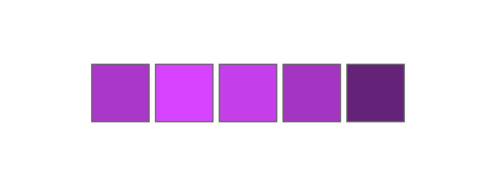

Los grises (`gray`) tienen la particularidad de que puedes ponerles un número entre 1 y 99 para ajustar su brillo:

``` r
escala <- c("gray2", "gray10", "gray30", "gray50", "gray70", "gray90")
swatch(escala)
```


## Paletas de colores

Varios paquetes de R contienen sus propias paletas de colores prediseñadas. Uno de los conjuntos de paletas principales en visualización de datos, sobre todo para mapas, son las de [Color Brewer](https://colorbrewer2.org/#type=sequential&scheme=BuGn&n=3), a las que puedes acceder con el paquete `{RColorBrewer}`:

``` r
RColorBrewer::display.brewer.all()
```

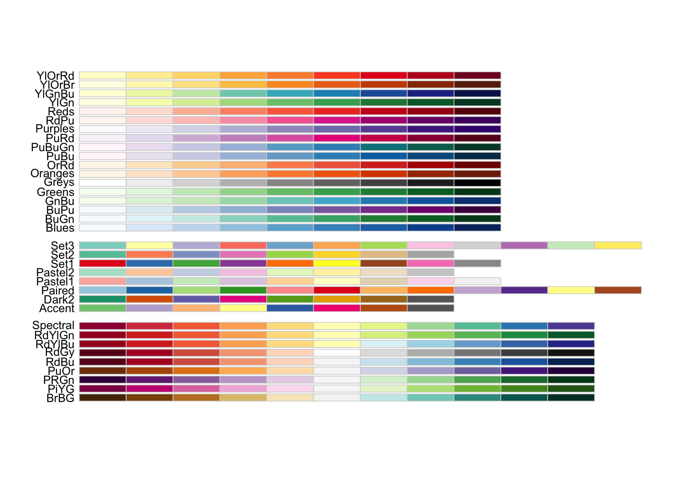

Cuando elijas una de las paletas, puedes usarla [en cualquier gráfico de `{ggplot2}`](../../../blog/r_introduccion/tutorial_visualizacion_ggplot/) con la función `scale_color_brewer()` o `scale_fill_brewer()`, según corresponda:

``` r
library(ggplot2)

iris |> 
  ggplot() +
  aes(x = Sepal.Length, y = Sepal.Width, color = Species) +
  geom_point(size = 4, alpha = 0.7) +
  # usar la paleta "PuRd"
  scale_color_brewer(palette = "PuRd") +
  theme_classic()
```

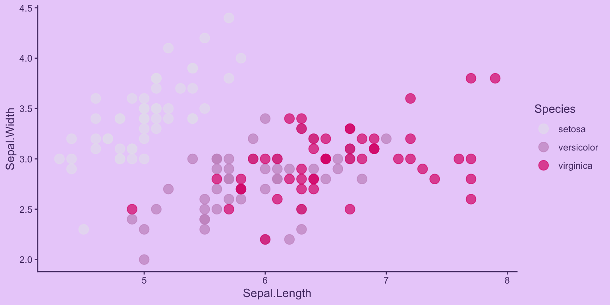

Con el paquete `{colorspace}` también podemos ver otras paletas disponibles:

``` r
library(colorspace)

colorspace::hcl_palettes(plot = TRUE)
```


Usar estas paletas en `{ggplot2}` es tan fácil como agregar la función de escala apropiada para definir los colores del gráfico:

``` r
iris |> 
  ggplot() +
  aes(Petal.Width, Sepal.Width, color = Sepal.Length) +
  geom_point(size = 4, alpha = 0.7) +
  # usar la paleta "Sunset" para una variable continua
  colorspace::scale_color_continuous_sequential(palette = "Sunset") +
  scale_y_continuous(expand = expansion(c(0, 0.1))) +
  theme_classic()
```


Encuentra una lista que compila todas las paletas de colores de la comunidad de R [en este repositorio.](https://github.com/EmilHvitfeldt/r-color-palettes)

## Usar paletas de colores

La forma más simple de usar colores en gráficos de `{ggplot2}` es definiéndolos en la escala de color apropiada.



Para una variable *discreta* o *categórica*, los colores se aplican en la capa `scale_color_manual()` y se aplican en el orden de la variable:

``` r
library(ggplot2)

iris |> 
  ggplot() +
  aes(Sepal.Width, Sepal.Length, 
      color = Species) +
  geom_point(size = 2, alpha = .8) +
  scale_color_manual(
    values = c("#cc3b7b", "#705ce6", "#668cf6")
  ) +
  theme_classic() +
  theme(legend.title = element_blank(),
        axis.title = element_blank())
```

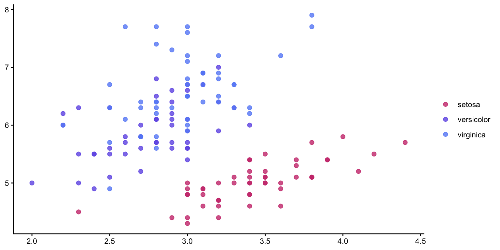

O bien, se puede aplicar cada color a cada valor específico de la variable:

``` r
iris |> 
  ggplot() +
  aes(Sepal.Width, Sepal.Length, 
      color = Species) +
  geom_point(size = 2, alpha = .8) +
  # especificar un color para cada valor de la variable
  scale_color_manual(
    values = c("versicolor" = "#cc3b7b", 
               "virginica" = "#705ce6", 
               "setosa" = "#668cf6")
  ) +
  theme_classic() +
  theme(legend.title = element_blank(),
        axis.title = element_blank())
```

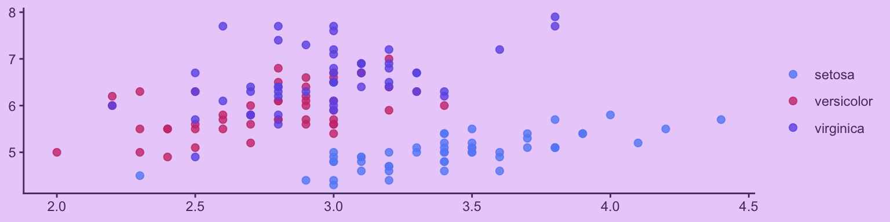

Muchas paquetes incorporan funciones de escalas de colores (`scale_color_x()`, `scale_fill_x()`) para aplicar una paleta de color fácilmente a un gráfico creado `{ggplot2}`.

``` r
library(ggplot2)
library(dplyr)
```

    Warning: package 'dplyr' was built under R version 4.4.3


    Attaching package: 'dplyr'

    The following objects are masked from 'package:stats':

        filter, lag

    The following objects are masked from 'package:base':

        intersect, setdiff, setequal, union

``` r
# escalas para variables discretas
iris |> 
  ggplot() +
  geom_bar(aes(Petal.Width, fill = Species)) +
  colorspace::scale_fill_discrete_qualitative(palette = "Dark 3") +
  scale_y_continuous(expand = expansion(c(0, 0.1))) +
  theme_classic()
```

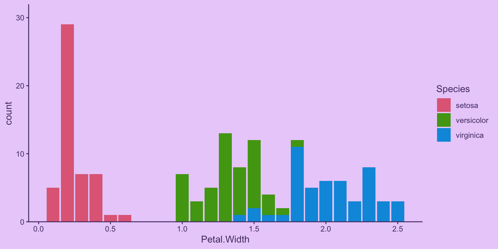

``` r
# escalas para variables continuas
iris |> 
  ggplot() +
  geom_point(aes(Sepal.Width, Sepal.Length, color = Petal.Width, size = Petal.Length), alpha = .8) +
  colorspace::scale_color_continuous_sequential(palette = "Sunset", na.value = "white") +
  theme_classic() +
  guides(size = guide_legend(override.aes = list(color = "#784FA1")),
         color = guide_colorsteps()) +
  theme(legend.title = element_blank(),
        axis.title = element_blank())
```

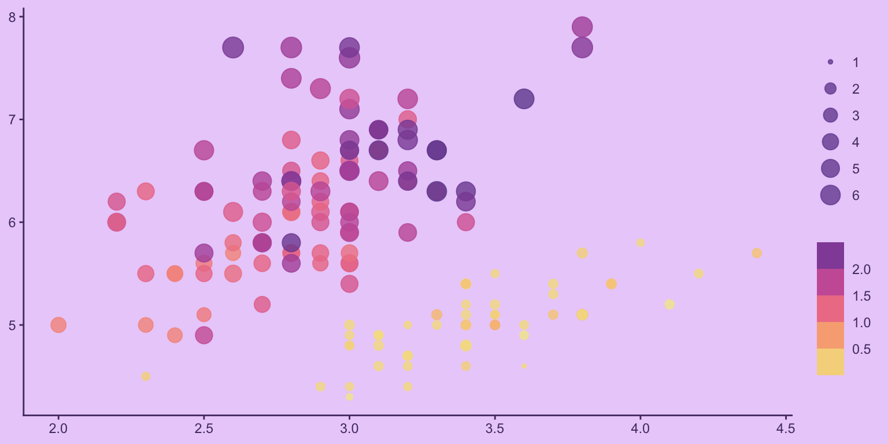

``` r
# escalas para variables continuas
iris |> 
  ggplot() +
  geom_point(aes(Petal.Length, Sepal.Width, color = Petal.Width, size = Sepal.Length), alpha = .8) +
  viridis::scale_colour_viridis("viridis", na.value = "white") +
  theme_classic() +
  guides(size = guide_legend(override.aes = list(color = "#88D181")),
         color = guide_colorsteps()) +
  theme(legend.title = element_blank(),
        axis.title = element_blank())
```

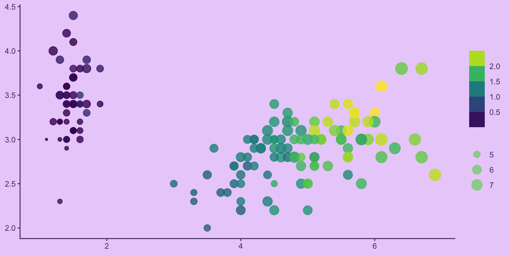

Algunas de las funciones para aplicar paletas de colores tienen funcionalidades extras. Por ejemplo, las funciones de `{colorspace}` permiten modificar sus paletas en términos de la saturación (*chroma*) y el brillo del color (*luminance*), entregándote más libertad al momento de definir una apariencia específica:

``` r
grafico <- iris |> 
  ggplot() +
  geom_point(aes(Sepal.Width, Sepal.Length, color = Petal.Width), size = 3, alpha = .8) +
  theme_classic() +
  guides(color = guide_colorsteps()) +
  theme(legend.title = element_blank(),
        axis.title = element_blank())

grafico +
  colorspace::scale_color_continuous_sequential(
    palette = "TealGrn", 
    c1 = 50, # intensidad del color
    l1 = 60) # brillo del color
```


``` r
grafico +
  colorspace::scale_color_continuous_sequential(
    palette = "TealGrn", 
    c1 = 20, # intensidad del color
    l1 = 30) # brillo del color
```

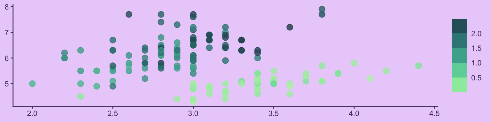

{{< aviso "Si quieres aprender `{ggplot2}`, revisa [este tutorial sobre visualización de datos desde cero!](/blog/r_introduccion/tutorial_visualizacion_ggplot/)" >}}

## Crear paletas de colores

También podemos usar funciones de R para crear paletas de colores personalizadas a partir de uno o varios colores, o especificando los rangos de variación de los colores.

### Crear paletas secuenciales

Las paletas secuenciales consiste en un degradado entre dos o más colores. Suelen usarse para representar una variable continua o numérica, cuyo valor va cambiando de forma cuantitativa.

La función `sequential_hcl()` del paquete `{colorspace}` permite crear paletas secuenciales

``` r
colorspace::sequential_hcl(8, h = 300) |> swatch()
```


``` r
colorspace::sequential_hcl(8, h = c(300, 100)) |> swatch()
```


``` r
colorspace::sequential_hcl(5, h = 260,
                           c = c(45, 25), l = c(25, 85), power = .9) |> swatch()
```


También se pueden obtener vectores de colores a partir de las paletas existentes que vienen con el paquete {colorspace}:

``` r
colorspace::sequential_hcl(5, palette = "Red-Blue") |> swatch()
```

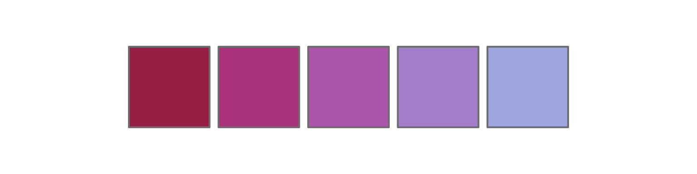

``` r
colorspace::sequential_hcl(5, palette = "Purple-Orange") |> swatch()
```

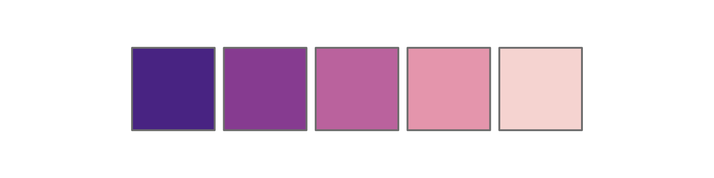

### Crear paletas cualitativas

Como su nombre ética, en las paletas cualitativas los colores van saltando para maximizar la diferencia entre ellos. Se utilizan para variables cualitativas, categóricas o discretas, donde cada elemento de una secuencia es independiente de los demás, y el objetivo del uso del color es poder distinguirlos.

La función `rainbow_hcl()` de `{colorspace}` entrega una típica paleta de arcoíris, pero con la posibilidad de modificar sus atributos de color en sus argumentos, tales como las tonalidades (*hue*) de inicio o final, la intensidad (*chroma*) de los tonos

``` r
colorspace::rainbow_hcl(7, c = 70) |> swatch()
```


``` r
colorspace::rainbow_hcl(7, c = 100, start = 190, end = 380) |> swatch()
```


``` r
colorspace::rainbow_hcl(6, c = 60, l = 30, start = 230, end = 370) |> swatch()
```


Éste tipo de paletas usualmente reúne colores en una escala tipo arcoíris, o bien reúne colores temáticos, distintos entre ellos, pero armónicos entre sí.

También pueden usarse los nombres de las paredes preexistentes para generar una secuencia cualitativa con ellos.

``` r
colorspace::qualitative_hcl(6, palette = "Cold", c = 80) |> swatch()
```

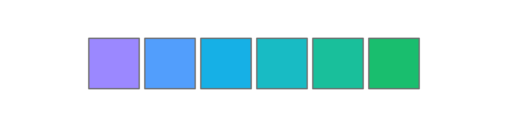

``` r
colorspace::qualitative_hcl(6, palette = "Warm", c = 80) |> swatch()
```


### Crear paletas divergentes

Las paletas divergentes se utilizan cuando una variable expresa a dos polos, una una misma magnitud donde los extremos son separados por una brecha central.

``` r
colorspace::diverging_hcl(n = 5, h = c(200, 300)) |> swatch()
```


``` r
colorspace::diverging_hcl(n = 7, h = c(700, 180)) |> swatch()
```


``` r
colorspace::diverging_hcl(n = 7, h = c(700, 180), c = 130, alpha = .7) |> swatch()
```


### Extender paletas de colores

Si tienes un vector de colores y necesitas alargarlo para tener más colores basados en la paleta original, puedes hacerlo con la función `colorRampPalette()`. Esta función crea otra *función* a partir de los colores, a la que luego le das el número de colores que necesites obtener a partir de la paleta original:

``` r
# paleta de 5 colores
paleta <- c("#f4b43f", "#ec6a2d", "#cc3b7b", "#705ce6", "#668cf6")

swatch(paleta)
```

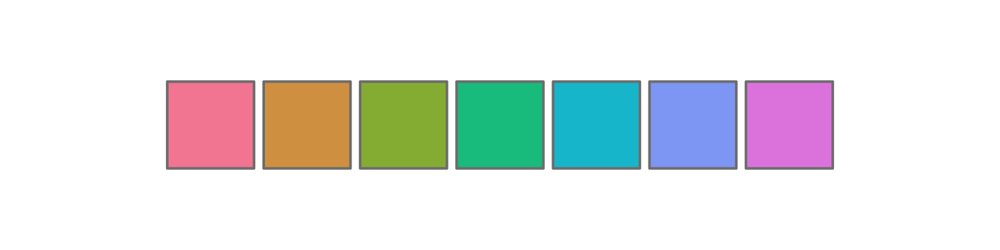

``` r
# extender la paleta de 5 colores a 12 colores
colorRampPalette(paleta)(12) |> swatch()
```

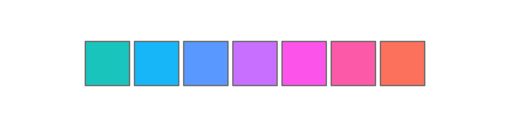

También podemos usar esta función para crear con facilidad una paleta secuencial entre dos o más colores:

``` r
colores <- c("#df65b2", "#fae55f")

# extender la paleta a 8 colores
colorRampPalette(colores)(8) |> swatch()
```

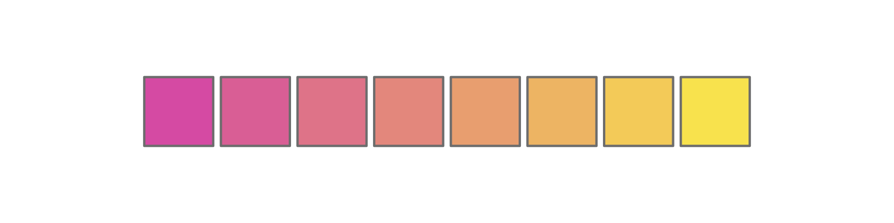

## Personalizar y crear colores

### Modificar colores existentes

Las funciones del paquete `{shades}` nos permitan obtener información detallada sobre cada uno de los colores, y usar esta misma información para modificarlos con mucho detalle.

Por ejemplo, definamos un color, y luego obtengamos el valor de su tonalidad. Recordemos que la tonalidad de los colores se expresan como grados entre 0° y 360°.

``` r
library(shades)

color <- "#f65b74"

swatch(color)
```


``` r
hue(color)
```

    [1] 350.3226

Obtenemos que, para el color definido, el valor de su tonalidad es 350. Podemos usar esta información para modificar levemente el mismo color y así obtener una variable del mismo color levemente más anaranjada.

``` r
swatch(c(color, hue(color, 370)))
```

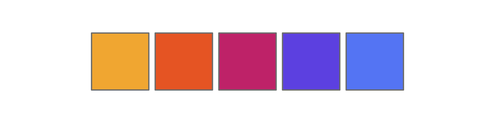

Podemos obtener mismos resultados utilizando el *delta* de la tonalidad del color; es decir, sumándole restándole una cantidad de grados a el valor de la tonalidad del color mismo:

``` r
swatch(c(color, hue(color, delta(50))))
```


Al usar la función `delta()`, lo que hacemos es pedirle que cambie la tonalidad del color en 50°, volviéndose en un tono amarillo.

Podemos obtener un resultado similar usando `col_shift()` del paquete `{scales}`:

``` r
library(scales)
show_col(c(color, col_shift(color, 20)))
```

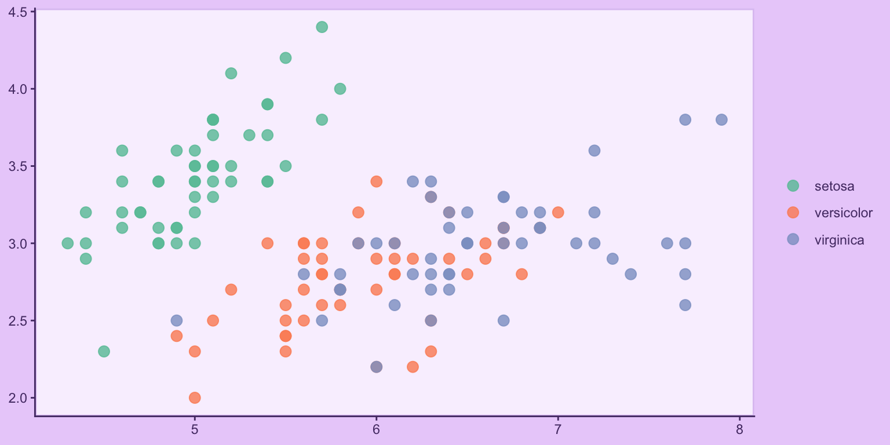

El **brillo** (*brighness*) va de cero a uno, mientras que la claridad (*lightness*) va de cero a 100.

``` r
color |> brightness(0.7) |> swatch()
```

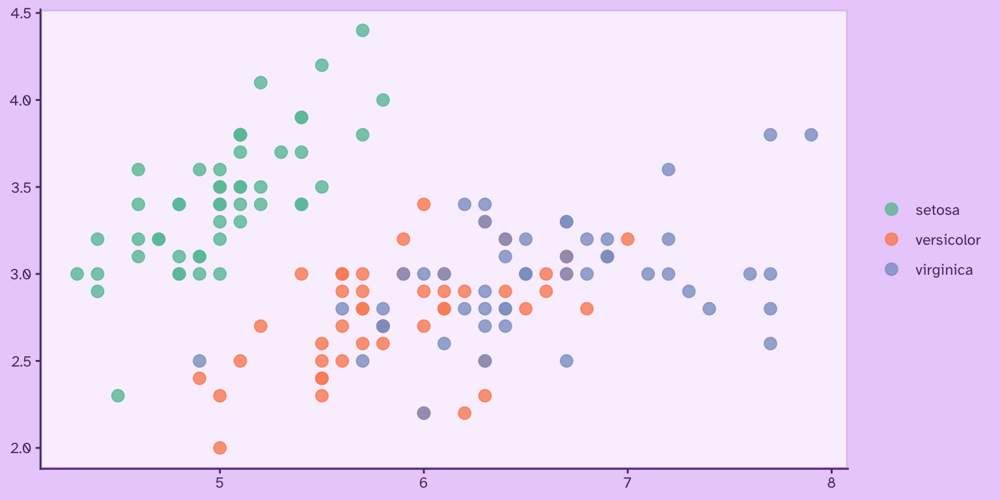

``` r
color |> lightness(delta(20)) |> swatch()
```


Con `{scales}`, la función `col_lighter()` realiza el mismo propósito:

``` r
col_lighter(color, 20) |> show_col()
```

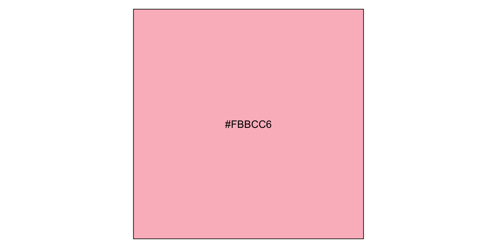

Por su parte, la **saturación** aumenta la intensidad del color.

``` r
color |> saturation(delta(30)) |> swatch()
```


Podemos utilizar la función `delta()` para crear una sencilla paleta de colores a partir de un mismo color, aumentando y disminuyendo su intensidad (*chroma*):

``` r
swatch(
  c(color |> chroma(delta(30)), 
    color,
    color |> chroma(delta(-30)))
)
```

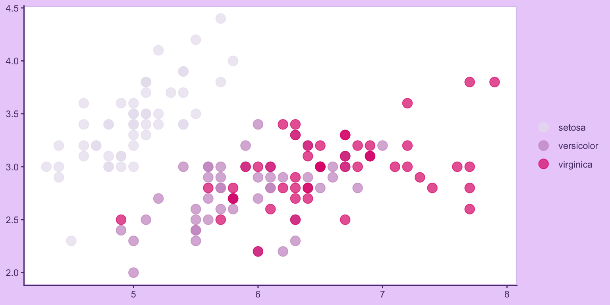

En `{scales}`, la función es `col_saturate()`:

``` r
col_saturate(color, -50) |> show_col()
```

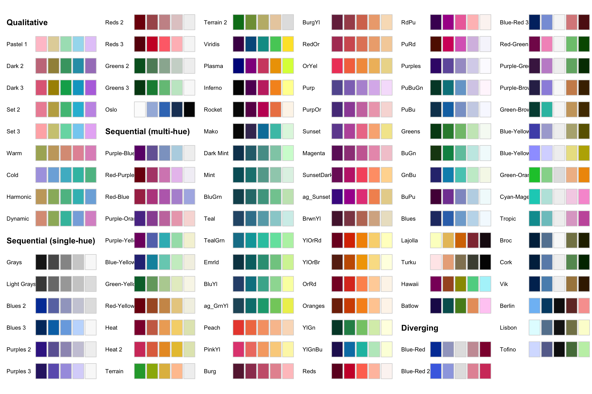

Podemos combinar estas técnicas para crear una paleta de colores más compleja, construida toda a partir de un solo color al cual se le va aumentando o disminuyendo sus valores de claridad e intensidad. El beneficio de hacerlo de esta manera es que luego basta con cambiar el color principal para obtener una paleta de iguales características, pero basada en una tonalidad distinta.

``` r
color_principal = "#4D4484"

color_fondo = color_principal |> lightness(13) |> chroma(20)
color_detalle = color_principal |> lightness(20) |> chroma(40)
color_destacado = color_principal |> lightness(50) |> chroma(65)
color_texto = color_principal |> lightness(80)

swatch(c(color_principal,
         color_fondo,
         color_detalle,
         color_destacado,
         color_texto))
```

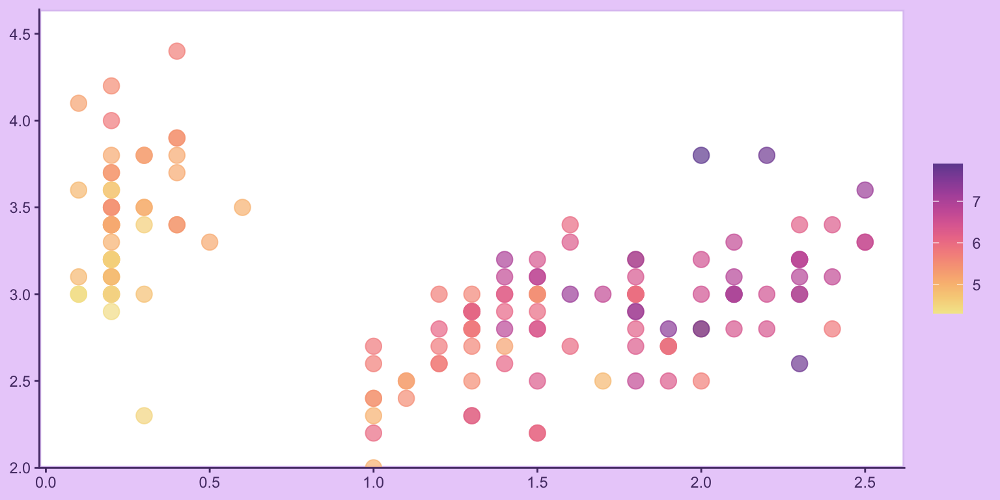

``` r
color_principal = "#3170ac"

color_fondo = color_principal |> lightness(13) |> chroma(20)
color_detalle = color_principal |> lightness(20) |> chroma(40)
color_destacado = color_principal |> lightness(50) |> chroma(65)
color_texto = color_principal |> lightness(80)

swatch(c(color_principal,
         color_fondo,
         color_detalle,
         color_destacado,
         color_texto))
```

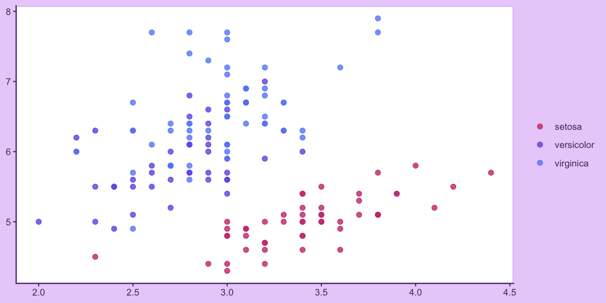

Notar que el código es igual, y sólo se cambió el valor del `color_principal`. Esta estrategia es muy útil si se están produciendo visualizaciones o aplicaciones que ocupan una paleta de colores monocroma.

### Mezclar colores

Las funciones `submix()` y `addmix()` del paquete {shades} facilitan el mezclado de colores sustraje ctivo y aditivo, respectivamente. A partir de dos colores, entrega la mezcla de ellos, abriendo muchas posibilidades para la experimentación y creación de nuevos colores:

``` r
swatch(c("#70f1d5",
         submix("#70f1d5", "#fae55f"),
         "#fae55f"))
```

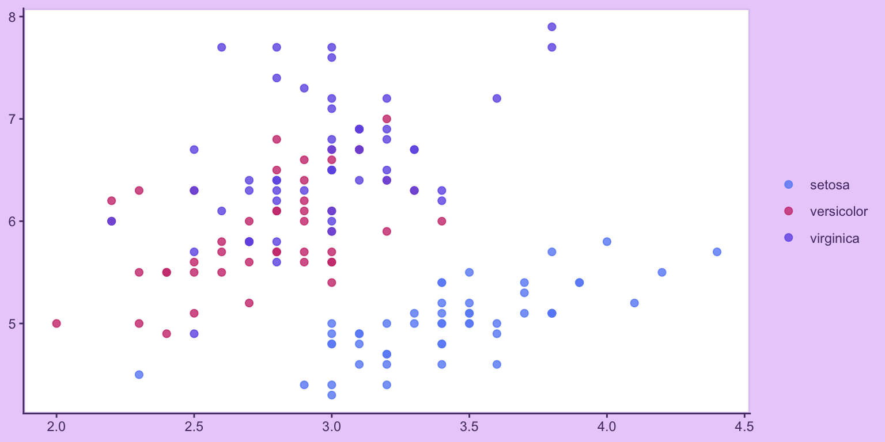

``` r
swatch(c("#3377f7",
         addmix("#3377f7", "#ec4e3c"),
         "#ec4e3c"))
```

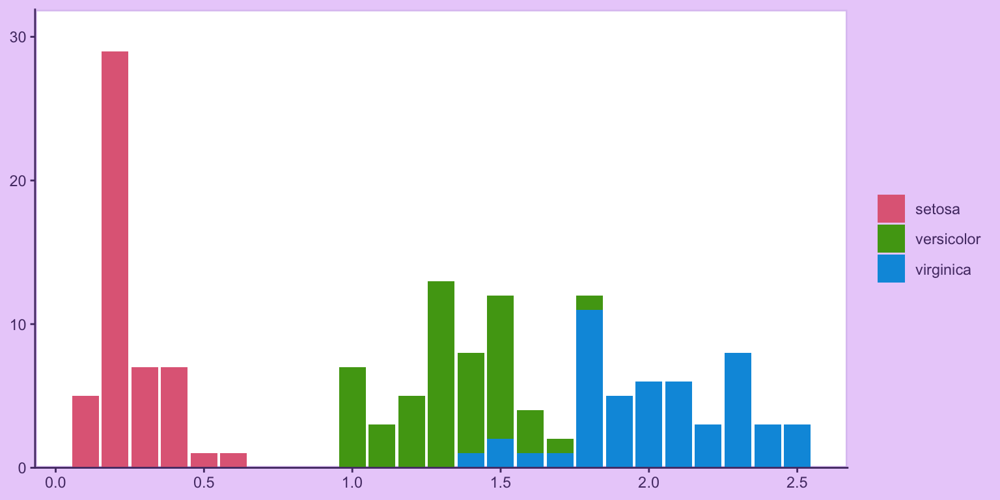

``` r
swatch(c("#f9ce45",
         submix("#f9ce45", "#77d671", amount = 0.5),
         "#77d671"))
```

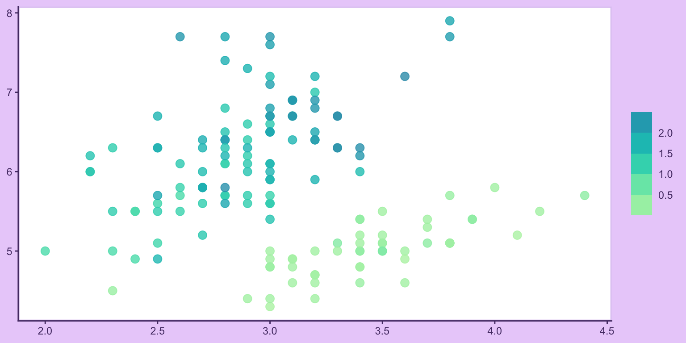

El paquete `{scales}` también provee una función para mezclar colores. Se puede usar esta función para tomar una paleta de colores y volverla más coherente al aplicarle una pequeña fracción de otro color, en este caso naranja:

``` r
col_mix(a = c("#77d671", "#70f1d5", "#fae55f", "#ff479c"),
        b = "orange2", 
        amount = 0.2) |> show_col()
```

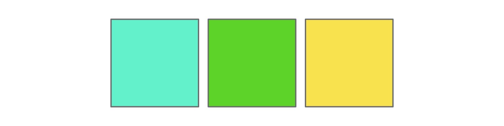

### Crear colores

Puedes crear un color en R definiendo su tonalidad (*hue*), saturación (*saturation*) y brillo (*value*) con `hsv()`, entendiendo que el matiz es la posición del color en la escala de todos los colores, que va del 0 al 1, empezando y terminando con el rojo:

``` r
color <- hsv(h = 0, s = 1, v = 1)
swatch(color)
```


Para guiarse, la siguiente gráfica muestra la tonalidad de colores entre `0` y `1`,

    Warning: package 'purrr' was built under R version 4.4.3

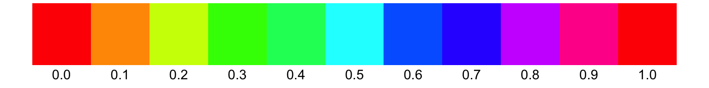

Siguiendo el gráfico anterior, vemos que el tono `0.8` corresponde al color morado, así que podemos crearlo con `hsv()`:

``` r
color <- hsv(0.85, 1, 1)
swatch(color)
```


Luego podemos modificar la saturación y brillo del color con los otros dos argumentos de `hsv()`:

``` r
color <- hsv(0.82, 0.5, 0.4)
swatch(color)
```

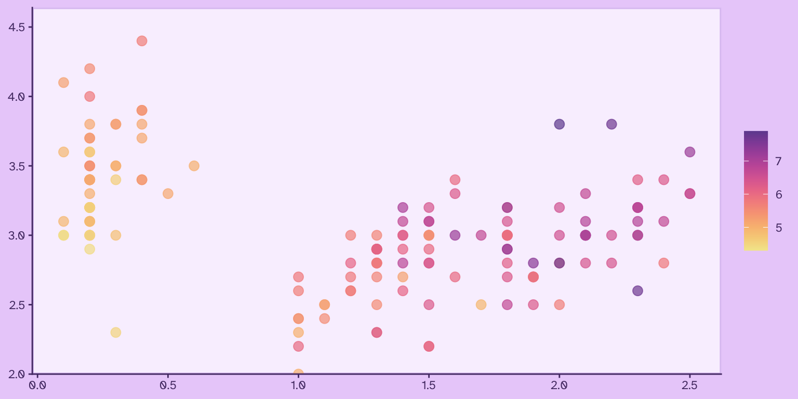

------------------------------------------------------------------------



## Avanzado

`{colorspace}` incluye funciones para poder visualizar secuencias de colores en proyecciones del espacio de color HCL (*hue, chroma, luminance*), lo que nos permite contextualizar las paletas en un espacio perceptual del color basado en estos tres parámetros.

``` r
colorspace::hclplot(sequential_hcl(7, h = 260, c = 80, l = c(35, 95), power = 1.5))
```

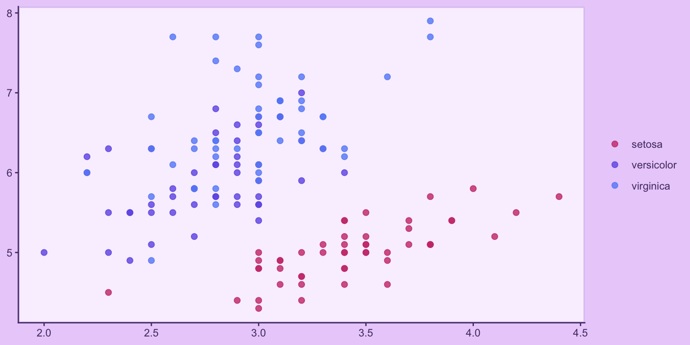

``` r
colorspace::hclplot(sequential_hcl(7, h = c(260, 220), c = c(50, 75, 0), l = c(30, 95), power = 1))
```

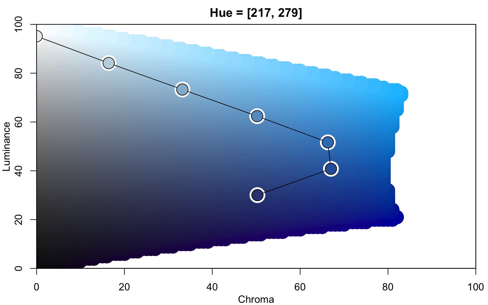

------------------------------------------------------------------------

## Fuentes y recursos

- https://github.com/EmilHvitfeldt/r-color-palettes
- https://r-graph-gallery.com/ggplot2-color.html
- https://www.datanovia.com/en/blog/top-r-color-palettes-to-know-for-great-data-visualization/
- https://jbengler.github.io/tidyplots/articles/Color-schemes.html
- https://emilhvitfeldt.com/post/2019-10-01-manipulating-colors-with-prismatic/index.html


