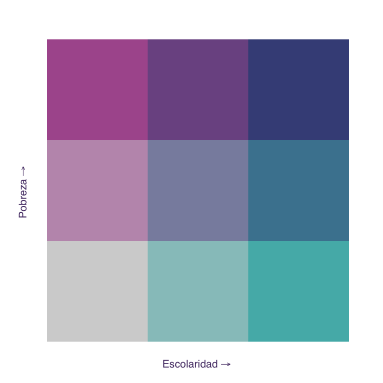
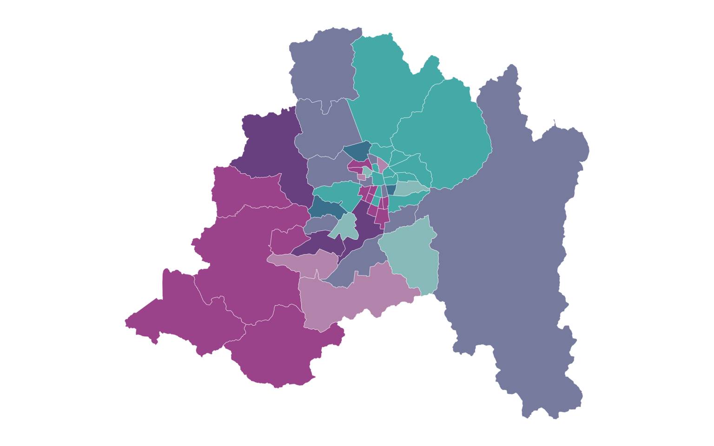
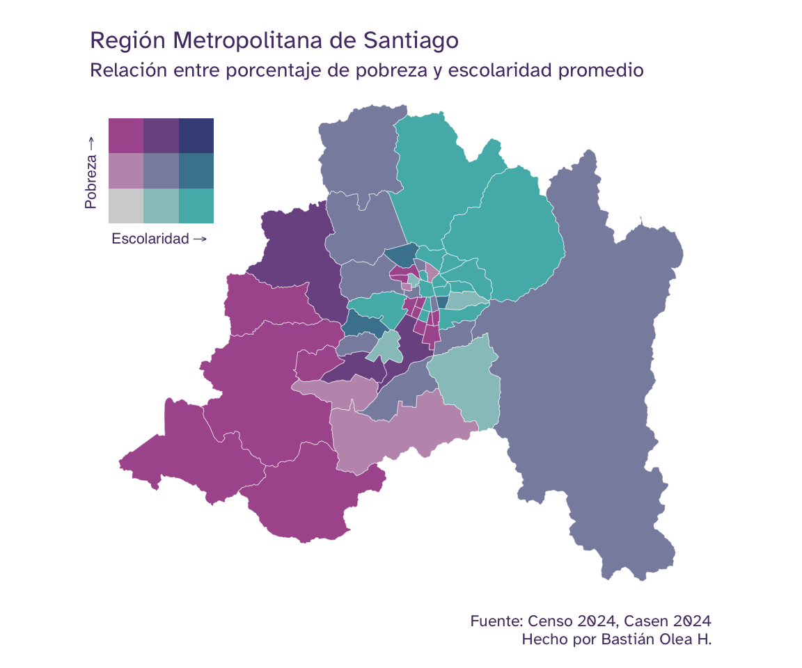
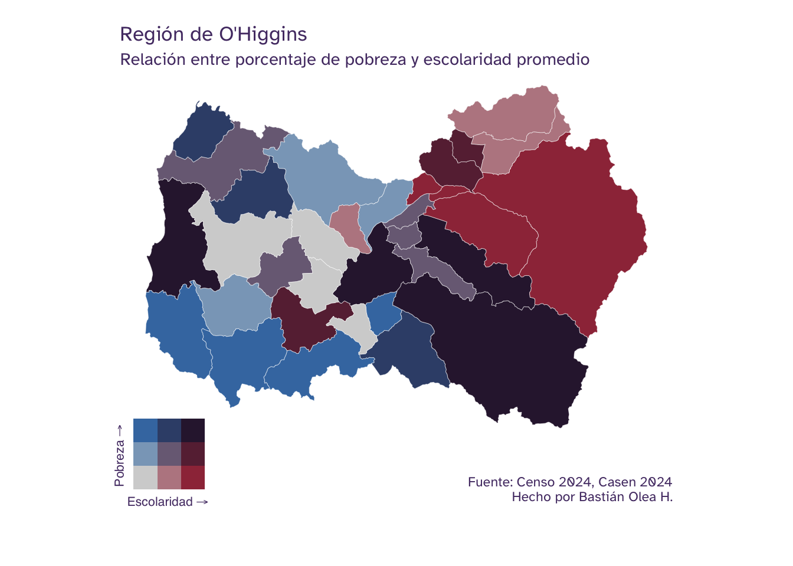

Normalmente, cuando [creamos un mapa](./tags/mapas/) que visualice datos mediante color sólo podemos mostrar **un fenómeno a la vez**: la población de cada territorio, el ingreso promedio, el porcentaje de algo, etc. Pero, ¿qué pasa si queremos observar **cómo se relacionan dos variables** en un mismo mapa? Para eso existen los **mapas bivariados**! En vez de usar una [escala de colores](./blog/colores/) en una sola dimensión (por ejemplo, un color que va desde claro a oscuro), un mapa bivariado usa una **paleta de colores en dos dimensiones**: una cuadrícula de colores donde cada eje representa una variable distinta. De este modo, el color de cada territorio nos indica al mismo tiempo el valor de las dos variables, y podemos detectar visualmente en qué lugares ambas coinciden en ser altas, bajas, o una alta y la otra baja.

En este tutorial crearemos un mapa bivariado de nivel comunal que cruza el **promedio de escolaridad**, obtenido del [Censo de Población y Vivienda 2024](./blog/censo_2024/), con la **pobreza por ingresos**, estimada por el [Ministerio de Desarrollo Social de Chile](https://bidat.gob.cl/directorio/Pobreza%20comunal/estimaciones-de-pobreza-comunal-2024).

## Obtención de datos

Nuestro objetivo es obtener una tabla con dos indicadores por comuna:

1.  **Promedio de años de escolaridad** de los habitantes de cada comuna de Chile, según el Censo 2024.
2.  **Porcentaje de personas en situación de pobreza por ingresos**, según las estimaciones comunales realizadas por el Ministerio de Desarrollo Social en 2024.

Como los datos vienen de dos fuentes distintas, los prepararemos por separado y luego los [uniremos](./blog/left_join/) por comuna.

### Escolaridad según el Censo 2024

Los datos de escolaridad los obtenemos del Censo, que ya hemos usado [en tutoriales anteriores](./blog/censo_2024/), donde también vimos cómo descargar los microdatos y cargarlos como base de datos. Aquí repasaremos el proceso de forma más resumida, así que si no tienes experiencia con este conjunto de datos te recomiendo revisar ese tutorial primero.



Lo primero es descargar los microdatos del Censo, [disponibles en su sitio oficial](https://censo2024.ine.gob.cl), en el archivo *Base de microdatos - Viviendas, hogares, personas Censo 2024 (parquet)*.



Cargamos la base de *personas* con la función `open_dataset()` de `{arrow}`, que abre los datos como [una base de datos](./blog/censo_2024/#cargar-datos-del-censo-en-r): esto significa que podemos filtrar y consultar millones de observaciones de forma eficiente, incluso cuando los datos son más grandes que la memoria de nuestras computadoras, y solamente cuando terminamos de manipular los datos copiamos los resultados a la memoria con la función `collect()`.

``` r
library(arrow)

personas <- open_dataset("personas_censo2024.parquet")
```



La base de personas incluye la variable `escolaridad`, que corresponde a los **años de escolaridad** de cada persona. Para calcular el promedio comunal, primero filtramos los valores válidos (`escolaridad != 99`) y consideramos solamente a personas de **25 años o más** (`[^1] >= 25`)[^1], edad a la que la mayoría ya completó su trayectoria educativa.

Luego agrupamos por comuna y calculamos el promedio con `summarize()`, y recién ahí traemos el resultado (ya resumido) a la memoria con `collect()`.

``` r
library(dplyr)

escolaridad_comuna <- personas |>
  filter(escolaridad != 99) |>
  filter(edad_quinquenal >= 25) |> 
  rename(codigo_comuna = comuna) |> 
  group_by(codigo_comuna) |>
  summarize(escolaridad = mean(escolaridad)) |>
  collect() # traer los resultados a la memoria

escolaridad_comuna
```

    # A tibble: 346 × 2
       codigo_comuna escolaridad
               <int>       <dbl>
     1          5802       10.9 
     2          4303        9.07
     3         11202       10.5 
     4          1101       11.6 
     5          8301       11.2 
     6         13124       10.9 
     7          8111       11.2 
     8         14108        9.44
     9         13101       13.1 
    10         13603       10.6 
    # ℹ 336 more rows



Obtenemos una tabla con el promedio de años de escolaridad por cada código de comuna.

### Pobreza por ingresos

El segundo indicador proviene de las [estimaciones de pobreza comunal por ingresos](https://bidat.gob.cl/directorio/Pobreza%20comunal/estimaciones-de-pobreza-comunal-2024) (2024) calculadas por el Ministerio de Desarrollo Social de Chile a partir de la [encuesta Casen](./blog/casen_introduccion/).



Cargamos el archivo `sae_ingresos_2024.xlsx` con `read_xlsx()` y como no viene muy limpio para su trabajo, lo limpiamos primero:

- Usamos `row_to_names(2)` para usar la segunda fila como nombres de columna (porque viene con una fila en blanco)
- Con `clean_names()` de `{janitor}` limpiarmos los nombres de columnas esos nombres
- Renombramos la columna del porcentaje de pobreza para que sea más corta, y la de `codigo_comuna` para que coincida con el Censo,
- Convertimos a números las columnas del código de comuna y del porcentaje
- Nos quedamos solo con las columnas que necesitamos: el nombre y código de las comunas, y el porcentaje de pobreza.
- Finalmente, filtramos también las filas sin código de comuna válido (como totales o encabezados) con `filter(!is.na(comuna))`.

``` r
library(readxl)

pobreza <- read_xlsx("sae_ingresos_2024.xlsx")
```

``` r
library(janitor)

pobreza_comuna <- pobreza |>
  row_to_names(2) |>
  clean_names() |>
  rename(codigo_comuna = codigo,
         pobreza = 6) |>
  mutate(codigo_comuna = as.numeric(codigo_comuna),
         pobreza = as.numeric(pobreza)) |> 
  select(codigo_comuna,
         nombre_comuna,
         pobreza) |>
  filter(!is.na(codigo_comuna))
```

### Unir ambos indicadores

Ahora que tenemos nuestras dos tablas, ambas con una columna `codigo_comuna`, las unimos con `left_join()`, tomando la tabla de escolaridad como base y agregándole la tabla de pobreza. Como la tabla de pobreza trae los nombres de las comunas, los reubicamos al principio con `relocate()`.

``` r
datos <- escolaridad_comuna |>
  left_join(pobreza_comuna, 
            by = join_by(codigo_comuna)) |>
  relocate(nombre_comuna, .before = codigo_comuna)

datos
```

    # A tibble: 346 × 4
       nombre_comuna codigo_comuna escolaridad pobreza
       <chr>                 <dbl>       <dbl>   <dbl>
     1 Limache                5802       10.9    0.203
     2 Monte Patria           4303        9.07   0.247
     3 Cisnes                11202       10.5    0.165
     4 Iquique                1101       11.6    0.162
     5 Los Ángeles            8301       11.2    0.193
     6 Pudahuel              13124       10.9    0.154
     7 Tomé                   8111       11.2    0.212
     8 Panguipulli           14108        9.44   0.323
     9 Santiago              13101       13.1    0.102
    10 Isla De Maipo         13603       10.6    0.162
    # ℹ 336 more rows



Obtenemos una tabla con una fila por comuna y dos columnas de interés: `escolaridad_prom` (promedio de años de escolaridad) y `pobreza_p` (proporción de personas en pobreza). Estas serán las dos variables que cruzaremos en el mapa bivariado.

------------------------------------------------------------------------

## Unir los datos con el mapa

Ahora necesitamos obtener los **polígonos de las comunas** de Chile para poder dibujar el mapa. Obtendremos los mapas de Chile desde el [paquete `{chilemapas}`](https://pacha.dev/chilemapas/), como hemos visto en [otros tutoriales de mapas](./blog/tutorial_mapa_chile/) de este blog.

Si no tienes `{chilemapas}`, instálalo:

``` r
pak::pak("pachadotdev/chilemapas")
```

Cargamos el mapa comunal, convertimos los códigos de comuna y región a números (para que coincidan con nuestros datos), y renombramos las columnas para que tengan los mismos nombres que usamos en `datos`:

``` r
library(chilemapas)

mapa_comunas <- chilemapas::mapa_comunas |>
  mutate(codigo_comuna = as.numeric(codigo_comuna),
         codigo_region = as.numeric(codigo_region)) |>
  select(-codigo_provincia) |> 
  st_as_sf()
```

Con las columnas alineadas, cruzamos nuestros datos con el mapa usando `left_join()` por la variable `comuna`. Así, cada comuna del mapa queda asociada a sus dos indicadores.

``` r
mapa_datos <- datos |>
  left_join(mapa_comunas,
            by = join_by(codigo_comuna)) |> 
  relocate(codigo_region, .after = codigo_comuna)

mapa_datos
```

    # A tibble: 346 × 6
       nombre_comuna codigo_comuna codigo_region escolaridad pobreza
       <chr>                 <dbl>         <dbl>       <dbl>   <dbl>
     1 Limache                5802             5       10.9    0.203
     2 Monte Patria           4303             4        9.07   0.247
     3 Cisnes                11202            11       10.5    0.165
     4 Iquique                1101             1       11.6    0.162
     5 Los Ángeles            8301             8       11.2    0.193
     6 Pudahuel              13124            13       10.9    0.154
     7 Tomé                   8111             8       11.2    0.212
     8 Panguipulli           14108            14        9.44   0.323
     9 Santiago              13101            13       13.1    0.102
    10 Isla De Maipo         13603            13       10.6    0.162
    # ℹ 336 more rows
    # ℹ 1 more variable: geometry <MULTIPOLYGON [°]>



Ahora tenemos una tabla con las dos variables que queremos, junto a los polígonos comunales, así que estamos listxs para visualizar los mapas!

## Clasificar datos bivariados

Para facilitar la creación de un mapa bivariado usaremos el paquete [`{biscale}`](https://chris-prener.github.io/biscale/), que se encarga de **clasificar las dos variables en categorías** y de asignarles una **paleta de colores en dos dimensiones**.

Si no lo tienes instalado, hazlo con:

``` r
install.packages("biscale")
```

Antes de clasificar, definiremos dos parámetros que nos servirán para ajustar el mapa fácilmente: la **región** que queremos visualizar y el número de **dimensiones** de la paleta, es decir, en cuántos niveles se divide cada variable.

``` r
region_mapa <- 13
dimensiones <- 3
```



Filtramos la región elegida y aplicamos `bi_class()` para clasificar cada comuna del mapa con una clase bivariada, según los valores que tenga cada territorio en cada una de las variables de interés. Le indicamos las dos variables (`x` e `y`), el método de clasificación, y el número de dimensiones:

``` r
library(biscale)

mapa_datos_bi <- mapa_datos |>
  filter(codigo_region == region_mapa) |>
  bi_class(x = escolaridad,
           y = pobreza,
           style = "quantile",
           dim = dimensiones)

mapa_datos_bi |> 
  select(nombre_comuna, codigo_comuna, bi_class)
```

    # A tibble: 52 × 3
       nombre_comuna    codigo_comuna bi_class
       <chr>                    <dbl> <chr>   
     1 Pudahuel                 13124 2-2     
     2 Santiago                 13101 3-1     
     3 Isla De Maipo            13603 1-2     
     4 Melipilla                13501 1-3     
     5 Huechuraba               13107 3-1     
     6 Maipú                    13119 3-1     
     7 Quinta Normal            13126 2-1     
     8 Providencia              13123 3-1     
     9 Estación Central         13106 2-2     
    10 San Bernardo             13401 2-3     
    # ℹ 42 more rows

El resultado incluye una columna nueva, `bi_class`, con valores como `"1-1"`, `"2-3"`, etc. Cada número indica en qué tercio (o categoría) cae la comuna para cada variable: el primer número corresponde al eje `x` (escolaridad) y el segundo al eje `y` (pobreza).

## Visualizar el mapa bivariado



``` r
library(ggplot2)

theme_set(
  theme_void(
    base_family = "Atkinson Hyperlegible",
    paper = "#EAD1FA",
    ink = "#543A73",
    accent = "#9069C0"
  ) +
    # margen de mapas
    theme(plot.margin = unit(c(2, 2, 2, 2), "mm")) +
    # fondo transparente (paper de theme_void deja fondo opaco)
    theme(plot.background = element_rect(fill = "transparent", color = "transparent"))
)
```



Construir un mapa bivariado requiere de dos pasos: hacer el mapa en sí, y hace la leyenda en forma de cuadrícula que explica los colores. Luego uniremos ambos pasos con `{patchwork}`.

Pero primero, elegimos una de las [paletas bivariadas que ofrece `{biscale}`](https://chris-prener.github.io/biscale/articles/bivariate_palettes.html). Hay varias disponibles, como `"DkBlue"`, `"BlueOr"` o `"DkViolet2"`.

``` r
paleta <- "DkBlue2"
```

### Leyenda bivariada

Como ya dijimos, la leyenda de un mapa bivariado es una **cuadrícula** que muestra todas las combinaciones posibles de las dos variables; en nuestro caso, una cuadrícula de 3×3.
Podemos crear la leyenda bivariada con `bi_legend()`, usando la misma paleta y dimensiones que el mapa, y etiquetando cada eje:

``` r
leyenda <- bi_legend(pal = paleta,
                     dim = dimensiones,
                     xlab = "Escolaridad",
                     ylab = "Pobreza",
                     size = 8) +
  # fondo transparente para insertarla sobre el mapa
  theme(plot.background = element_blank(),
        panel.background = element_blank(),
        panel.grid.major = element_blank(),
        axis.title = element_text(color = "#543A73"))
```

En concreto, la leyenda bivariada es un gráfico por sí mismo, así que podemos previsualizarla:

``` r
leyenda
```



### Mapa bivariado

Creamos el mapa con `{ggplot2}` y `geom_sf()` (como vimos en el [tutorial de mapas con `{sf}`](./blog/mapas_sf/)), definiendo la escala de colores con `bi_scale_fill()` de `{biscale}` para expresar la columna `bi_class` en la paleta de colores en dos dimensiones. Ocultamos la leyenda automática (`show.legend = FALSE`) porque usaremos la leyenda personalizada que creamos recién.

``` r
mapa <- mapa_datos_bi |>
  st_as_sf() |>
  ggplot() +
  aes(fill = bi_class) +
  geom_sf(show.legend = FALSE,
          linewidth = 0.1, color = "white") +
  # escala de colores bivariada
  bi_scale_fill(pal = paleta, dim = dimensiones)

mapa
```



Tenemos un mapa bivariado! Pero aún tenemos que agregarle la leyenda para que pueda ser interpretable.



### Combinar mapa y leyenda

Finalmente, usamos el paquete [`{patchwork}`](./blog/patchwork/) para **insertar la leyenda dentro del mapa** con `inset_element()`, ubicándola en una esquina. Los argumentos `left`, `bottom`, `right` y `top` definen la posición y el tamaño de la leyenda, en una escala de 0 a 1 relativa al gráfico.

``` r
library(patchwork)

mapa_bivariado <- mapa +
  labs(title = "Región Metropolitana de Santiago",
       subtitle = "Relación entre porcentaje de pobreza y escolaridad promedio",
       caption = "Fuente: Censo 2024, Casen 2024\nHecho por Bastián Olea H.") +
  inset_element(leyenda,
                left = -0.05, bottom = 0.65,
                right = 0.25, top = 1)

mapa_bivariado
```



Obtenemos un mapa bivariado donde cada comuna se colorea según la combinación de sus dos variables.



Siguiendo la leyenda, las comunas del color más oscuro (arriba a la derecha) son aquellas donde coinciden una **alta escolaridad promedio** y una **alta pobreza por ingresos**, mientras que los colores más tenues (abajo a la izquierda) corresponden a comunas con baja escolaridad y baja pobreza. La visualización nos permite distinguit comunas con **alta escolaridad y baja pobreza** (en celeste/calipso), y comunas con **baja escolaridad y alta pobreza** (en rosado/fucsia), que reflejan la relación inversa que solemos esperar entre educación y pobreza. Sin embargo, para afirmar que existe una asociación estadística entre ambas variables habría que aplicar las pruebas estadísticas apropiadas.

Lo bueno de haber **parametrizado** la región y las dimensiones al comienzo es que puedes reutilizar todo este código cambiando solo un par de valores: prueba cambiando la región (`region_mapa`), otra cantidad de dimensiones, o incluso otras variables para construir tus propios mapas bivariados![^2]

Para probar la parametrización, **repitamos el proceso** para generar otro mapa de una región distinta, repitiendo el código anterior, con leves ajustes para posicionar la leyenda correctamente:

``` r
library(ggplot2)
library(biscale)
library(sf)

# parámetros para la visualización
region_mapa <- 6
dimensiones <- 3
paleta <- "DkViolet2"

# preparar datos bivariados
mapa_datos_bi <- mapa_datos |>
  filter(codigo_region == region_mapa) |>
  bi_class(x = escolaridad,
           y = pobreza,
           style = "quantile",
           dim = dimensiones)

# generar la leyenda
leyenda <- bi_legend(pal = paleta,
                     dim = dimensiones,
                     xlab = "Escolaridad",
                     ylab = "Pobreza",
                     size = 8) +
  # fondo transparente para insertarla sobre el mapa
  theme(plot.background = element_blank(),
        panel.background = element_blank(),
        panel.grid.major = element_blank(),
        axis.title = element_text(color = "#543A73"))

# mapa bivariado
mapa <- mapa_datos_bi |>
  st_as_sf() |>
  ggplot() +
  aes(fill = bi_class) +
  geom_sf(show.legend = FALSE,
          linewidth = 0.1, color = "white") +
  # escala de colores bivariada
  bi_scale_fill(pal = paleta, dim = dimensiones)

# mapa + leyenda y textos
mapa_bivariado <- mapa +
  labs(title = "Región de O'Higgins",
       subtitle = "Relación entre porcentaje de pobreza y escolaridad promedio",
       caption = "Fuente: Censo 2024, Casen 2024\nHecho por Bastián Olea H.") +
  # agregar espacios abajo para ajustar la leyenda
  theme(plot.margin = unit(c(2, 2, 12, 2), "mm"),
        plot.caption = element_text(margin = margin(t = 20))) +
  # leyenda
  inset_element(leyenda,
                left = -0.05, bottom = -0.2,
                right = 0.2, top = 0.15)

mapa_bivariado
```



Dos mapas por el precio de uno! Pero en este segundo mapa pusimos la leyenda un poco distinto: hicimos espacio debajo del mapa en la capa `theme()` del gráfico, dado que la forma del mapa no dejaba muchos espacios para poner la leyenda.



## Recursos

- [Bivariate maps with ggplot2 and sf](https://timogrossenbacher.ch/bivariate-maps-with-ggplot2-and-sf/), por Timo Grossenbacher.
- [Make a bivariate choropleth map](https://www.joshuastevens.net/cartography/make-a-bivariate-choropleth-map/), por Joshua Stevens.
- [Creating professional bivariate maps in R](https://www.datawim.com/post/creating-professional-bivariate-maps-in-r/).
- [Documentación del paquete `{biscale}`](https://chris-prener.github.io/biscale/).




[^1]: Usamos `edad_quinquenal` en lugar de `edad` porque la edad viene con un proceso de anonimización de datos, mientras que la edad en quinquenios no.

[^2]: *Disclaimer:* usé un LLM para escribir el boceto de este post, porque tenía el código escrito hace mucho tiempo, pero no encontraba el tiempo para terminarlo.
