Este tutorial de R te explicará paso a paso a cómo obtener mapas de todo Chile usando el paquete [`{chilemapas}` desarrollado por Mauricio Vargas](https://github.com/pachadotdev/chilemapas), y hacer gráficos con estos mapas usando `{ggplot2}`.

En la primera parte veremos cómo **obtener los mapas** y cómo **visualizar datos comunales** usando mapas en R. Si necesitas una guía sobre mapas en R, [revisa este post.](../../../blog/mapas_sf/)

Luego, nos enfrentaremos a un problema común que se tiene al graficar un mapa de la Región Metropolitana de Santiago, que tiene que ver con la diferencia entre los límites comunales reales de cada comuna y los **límites urbanos** de las comunas. Es la diferencia entre tener un mapa de la RM que abarque sectores rurales como Paine y que llegue hasta Argentina, o un mapa que demarque la zona urbana de Santiago, aproximadamente correspondiente a la zona que atravieza el anillo de la autopista Américo Vespucio.

Con un mapa de la superficie urbana de la Región Metropolitana, obtenemos una figura que es más familiar al habitante promedio de la región, y que es la que usalmente vemos en la cotidianeidad, en contraste con un mapa geográficamente correcto de todo el territorio regional.



## Introducción

### Paquetes

Primero cargamos los paquetes que usaremos en este tutorial. Si no tienes alguno de ellos, intálalo con `install.packages()`.

``` r
# datos
library(dplyr) #manipulación de datos
library(janitor) #limpieza de datos
library(stringr) #manipulación de texto

# mapas
library(chilemapas) #mapas de chile
library(sf) #manipulación de mapas

# gráficos
library(ggplot2) #visualización de datos
library(viridis) #escalas de colores
library(scales) #escalas numéricas

# web scraping
library(rvest) #obtener datos desde páginas de internet
```

### Obtener un mapa regional

Primero, usaremos `{chilemapas}` para obtener los datos geográficos (polígonos o shapes) necesarios para producir un mapa de la Región Metropolitana:

``` r
# obtener mapa comunal
mapa_comunas <- chilemapas::mapa_comunas

# nombres de las comunas
nombres_comunas <- chilemapas::codigos_territoriales |> 
  select(matches("comuna"))

# mapa de la región metropolitana
mapa <- mapa_comunas |> 
  # especificar la geometría
  st_set_geometry(mapa_comunas$geometry) |> 
  # agregar nombres de comunas
  left_join(nombres_comunas, by = "codigo_comuna") |> 
  # filtrar la región metropolitana
  filter(codigo_region == "13")

mapa
```

    Simple feature collection with 52 features and 4 fields
    Geometry type: MULTIPOLYGON
    Dimension:     XY
    Bounding box:  xmin: -71.71523 ymin: -34.29093 xmax: -69.76999 ymax: -32.92194
    Geodetic CRS:  SIRGAS 2000
    # A tibble: 52 × 5
       codigo_comuna codigo_provincia codigo_region                         geometry
     * <chr>         <chr>            <chr>                       <MULTIPOLYGON [°]>
     1 13404         134              13            (((-70.61396 -33.73862, -70.609…
     2 13402         134              13            (((-70.61396 -33.73862, -70.623…
     3 13124         131              13            (((-70.75679 -33.38348, -70.780…
     4 13103         131              13            (((-70.72154 -33.43661, -70.724…
     5 13301         133              13            (((-70.37256 -33.10578, -70.376…
     6 13303         133              13            (((-70.72028 -32.95297, -70.723…
     7 13302         133              13            (((-70.79191 -33.17296, -70.783…
     8 13107         131              13            (((-70.59589 -33.33656, -70.590…
     9 13104         131              13            (((-70.68968 -33.36587, -70.682…
    10 13504         135              13            (((-71.27576 -33.40409, -71.263…
    # ℹ 42 more rows
    # ℹ 1 more variable: nombre_comuna <chr>

Podemos ver que obtuvimos un *dataframe* donde cada fila es una comuna, individualizada por su nombre y su código único territorial (`codigo_comuna`).

En esta tabla de datos, la columna `geometry` contiene la información geográfica de cada comuna, lo que permite visualizarlas como un mapa.

Por lo tanto, en cada fila tenemos información geográfica que representa polígonos comunales, donde cada polígono (o conjuto de polígonos) se corresponde con los datos existentes en las demás columnas, que pueden ser información como sus nombres, su población, o cualquier otra.

## Visualización



``` r
library(ggplot2)

theme_set(
  theme_minimal(
    paper = "#EAD2FA",
    ink = "#553A74",
    accent = "#9069C0",
    base_family = "Atkinson Hyperlegible") +
    theme(plot.title = element_text(face = "bold"),
          axis.title = element_blank()))
```



### Mapa básico de la región

Podemos visualizar el mapa anterior con `{ggplot2}`:

``` r
mapa |> 
  # iniciar gráfico
  ggplot() +
  # agregar capa con el mapa
  geom_sf(fill = "#553A74", col = "#EAD2FA", alpha = 0.8)
```

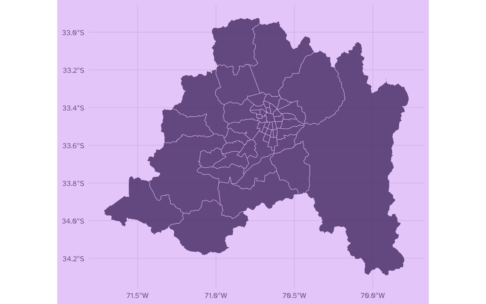

Obtuvimos un mapa básico de todas las comunas de la Región Metropolitana de Santiago!



### Mapa de la región con datos ficticios

Ahora, hagamos una prueba para aprender a visualizar datos en este tipo de mapa.s Para esto, vamos a **crear una variable** donde algunas comunas tengan valores distintos.

Podemos crear la nueva variable a partir de la columna `nombre_comuna`, aunque siempre es preferible hacerlo en base a la columna `codigo_comuna`, dado que los códigos únicos territoriales son identificadores únicos para cada comuna, mientras que los nombres de las comunas son más impredecibles (por ejemplo, pueden venir sin tilde o sin eñes, como pasa en este caso).

Usamos la función `case_when()` para asignar valores ficticios sobre algunas comunas:

``` r
mapa_datos <- mapa |> 
  # crear una variable para comunas específicas
  mutate(variable = recode_values(
    nombre_comuna,
    "Paine" ~ "Bacán",
    "Buin" ~ "Fome",
    "La Florida" ~ "Bacán",
    "Cerrillos" ~ "Bacán",
    "Nunoa" ~ "Fome")) |> 
  select(nombre_comuna, codigo_comuna, variable, geometry)

mapa_datos
```

    Simple feature collection with 52 features and 3 fields
    Geometry type: MULTIPOLYGON
    Dimension:     XY
    Bounding box:  xmin: -71.71523 ymin: -34.29093 xmax: -69.76999 ymax: -32.92194
    Geodetic CRS:  SIRGAS 2000
    # A tibble: 52 × 4
       nombre_comuna codigo_comuna variable                                 geometry
       <chr>         <chr>         <chr>                          <MULTIPOLYGON [°]>
     1 Paine         13404         Bacán    (((-70.61396 -33.73862, -70.60917 -33.7…
     2 Buin          13402         Fome     (((-70.61396 -33.73862, -70.62304 -33.7…
     3 Pudahuel      13124         <NA>     (((-70.75679 -33.38348, -70.78087 -33.4…
     4 Cerro Navia   13103         <NA>     (((-70.72154 -33.43661, -70.72426 -33.4…
     5 Colina        13301         <NA>     (((-70.37256 -33.10578, -70.37609 -33.1…
     6 Tiltil        13303         <NA>     (((-70.72028 -32.95297, -70.72329 -32.9…
     7 Lampa         13302         <NA>     (((-70.79191 -33.17296, -70.7833 -33.18…
     8 Huechuraba    13107         <NA>     (((-70.59589 -33.33656, -70.59023 -33.3…
     9 Conchali      13104         <NA>     (((-70.68968 -33.36587, -70.68201 -33.3…
    10 Maria Pinto   13504         <NA>     (((-71.27576 -33.40409, -71.26337 -33.4…
    # ℹ 42 more rows

Ahora visualizamos el resultado en un mapa:

``` r
# visualizar
mapa_datos |> 
  ggplot() +
  aes(fill = variable) + # usamos la variable que creamos como relleno de las comunas
  geom_sf(col = "#EAD2FA", alpha = 0.7) +
  scale_fill_discrete(na.value = "#9069C0") # color para comunas sin datos
```

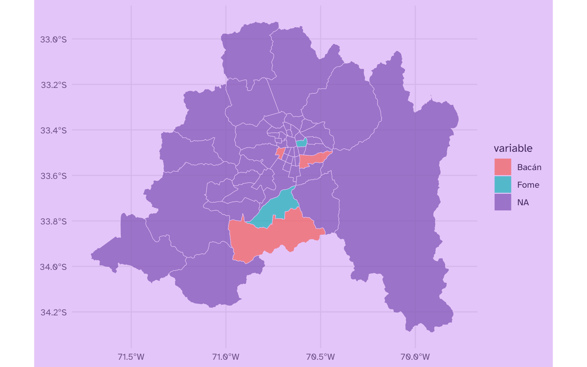



### Agregar datos obtenidos desde internet al mapa

Ahora, pasaremos a usar datos reales sobre nuestro mapa comunal. Pero en vez de entregarles datos copiados y pegados, obtendremos directamente los datos desde internet, [usando el paquete `{rvest}`](../../../blog/webscraping_rvest/) que sirve para hacer [web scraping](../../../blog/web_scraping/) desde páginas web; es decir, descargar datos presentes en sitios de internet para usarlos directamente en R.

``` r
library(rvest)

tabla_comunas <- session("https://es.wikipedia.org/wiki/Anexo:Comunas_de_Chile") |> # sitio web que scrapearemos
  read_html() |> # leemos el contenido del sitio web 
  html_table() # extraemos las tablas del sitio web

# limpiar tabla
tabla_comunas_2 <- tabla_comunas[[1]] |> # elegimos la primera tabla obtenida
  clean_names() |> # limpiamos los nombres de la tabla usando {janitor}
  remove_empty("cols") |>  # eliminar columnas vacías
  select(-latitud, -longitud)

# convertir los códigos comunales a texto
tabla_comunas_3 <- tabla_comunas_2 |>
  rename(codigo_comuna = 1) |> 
  mutate(codigo_comuna = as.character(codigo_comuna))

datos_comunas <- tabla_comunas_3 |> 
  # limpiar variables numéricas para estén disponibles en formato numérico en vez de como texto
  mutate(poblacion2020 = str_remove(poblacion2020, " "), # borrar espacios
         poblacion2020 = as.numeric(poblacion2020)) |>  # transformar texto a numérico
  # corregir superficie
  mutate(superficie_km2 = str_remove(superficie_km2, "\\."), # borrar puntos separadores de miles
         superficie_km2 = str_replace(superficie_km2, ",", "."), # reemplazar comas por puntos
         superficie_km2 = as.numeric(superficie_km2)) |> # transformar texto a numérico
  # corregir densidad
  mutate(densidad_hab_km2 = str_remove_all(densidad_hab_km2, "\\."), # borrar puntos separadores de miles
         densidad_hab_km2 = str_replace(densidad_hab_km2, ",", "."), # reemplazar comas por puntos
         densidad_hab_km2 = as.numeric(densidad_hab_km2)) |>  # transformar texto a numérico
  mutate(idh_2005 = as.numeric(idh_2005)) # transformar texto a numérico
```

Así quedó el resultado de nuestro web scraping:

``` r
glimpse(datos_comunas)
```

    Rows: 346
    Columns: 9
    $ codigo_comuna    <chr> "15101", "15102", "15201", "15202", "1101", "1107", "…
    $ nombre           <chr> "Arica", "Camarones", "Putre", "General Lagos", "Iqui…
    $ provincia        <chr> "Arica", "Arica", "Parinacota", "Parinacota", "Iquiqu…
    $ region           <chr> "Arica y Parinacota Arica y Parinacota", "Arica y Par…
    $ superficie_km2   <dbl> 4799.4, 3927.0, 5902.5, 2244.4, 2242.1, 5729.0, 13765…
    $ poblacion2020    <dbl> 247552, 1233, 2515, 810, 223463, 129999, 17395, 1375,…
    $ densidad_hab_km2 <dbl> 516.00, 31.00, 43.00, 36.00, 99.60, 226.80, 126.00, 6…
    $ idh_2005         <dbl> 0.866, 0.791, 0.817, 0.773, 0.826, 0.735, 0.772, 0.69…
    $ idh_2005_2       <chr> "Muy alto", "Alto", "Muy alto", "Alto", "Muy alto", "…



#### Agregar variables al mapa

A continuación, [usamos la función `left_join()`](../../../blog/left_join/) para adjuntar estas columnas nuevas a nuestro *data frame* que contiene los nombres y códigos de las comunas, además de la geometría o información geográfica de las comunas, usando como columna de unión los códigos comunales:

``` r
mapa_datos_2 <- mapa |> 
  left_join(datos_comunas, by = "codigo_comuna")

glimpse(mapa_datos_2)
```

    Rows: 52
    Columns: 13
    $ codigo_comuna    <chr> "13404", "13402", "13124", "13103", "13301", "13303",…
    $ codigo_provincia <chr> "134", "134", "131", "131", "133", "133", "133", "131…
    $ codigo_region    <chr> "13", "13", "13", "13", "13", "13", "13", "13", "13",…
    $ geometry         <MULTIPOLYGON [°]> MULTIPOLYGON (((-70.61396 -..., MULTIPOL…
    $ nombre_comuna    <chr> "Paine", "Buin", "Pudahuel", "Cerro Navia", "Colina",…
    $ nombre           <chr> "Paine", "Buin", "Pudahuel", "Cerro Navia", "Colina",…
    $ provincia        <chr> "Maipo", "Maipo", "Santiago", "Santiago", "Chacabuco"…
    $ region           <chr> "Metropolitana de Santiago Metropolitana de Santiago"…
    $ superficie_km2   <dbl> 820, 214, 197, 11, 9712, 653, 452, 448, 107, 3935, 69…
    $ poblacion2020    <dbl> 82766, 109641, 253139, 142465, 180353, 21477, 126898,…
    $ densidad_hab_km2 <dbl> 1009.0, 512.3, 1284.9, 12951.3, 185.7, 328.0, 280.7, …
    $ idh_2005         <dbl> 0.718, 0.731, 0.735, 0.683, 0.726, 0.709, 0.697, 0.73…
    $ idh_2005_2       <chr> "Alto", "Alto", "Alto", "Medio", "Alto", "Alto", "Med…

Lo que hicimos en la operación anterior fue [unir dos tablas distintas en base a una variable común](../../../blog/left_join/) que ambas tablas poseen: `codigo_comuna`. De este modo, obtenemos un nuevo data frame que contiene tanto la información geográfica como los datos comunales que necesitamos.



Habiendo hecho esto, ahora podemos crear gráficos comunales usando cualquier variable que queramos, siempre y cuando podamos hacer coincidir los datos con el mapa en base a los códigos comunales o los nombres de comuna.

### Visualizar datos

A continuación, ejemplos de visualización con las variables que agregamos a los mapas:

#### Mapa comunal de población

``` r
mapa_datos_2 |> 
  ggplot() +
  aes(geometry = geometry, fill = poblacion2020) +
  geom_sf(linewidth = 0.3, color = "#EBD2FA") +
  scale_fill_continuous(palette = "Sunset",
                        labels = label_number(big.mark = ".", decimal.mark = ",")) +
  labs(title = "Población por comunas",
       subtitle = "Región Metropolitana de Santiago",
       fill = "Población")
```

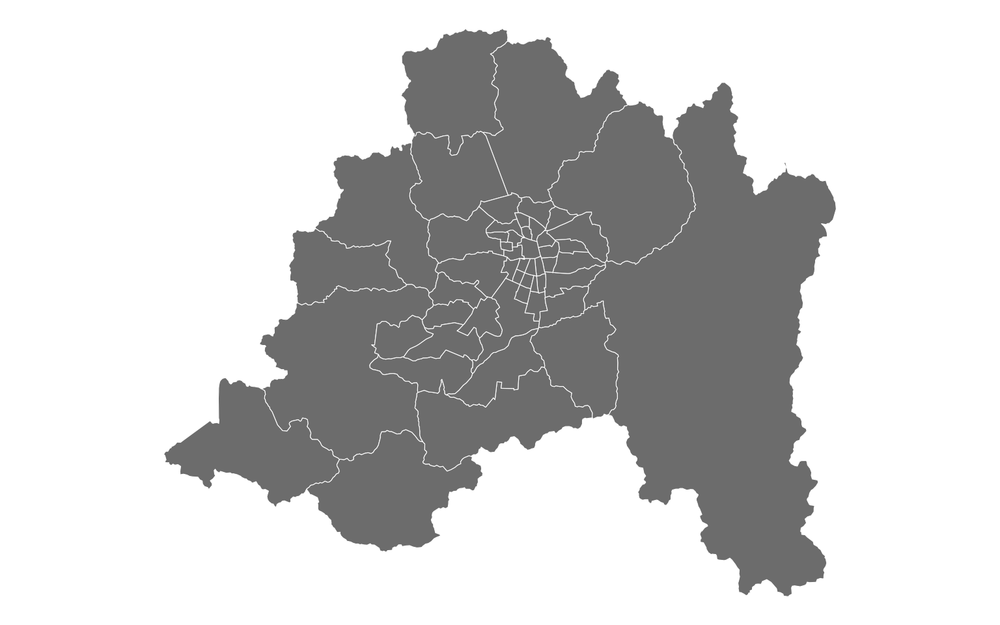

#### Mapa comunal del índice de desarrollo humano

``` r
mapa_datos_2 |> 
  ggplot() +
  aes(geometry = geometry, 
      fill = idh_2005_2) +
  geom_sf(linewidth = 0.2, color = "#EBD2FA") +
  scale_fill_manual(breaks = c("Medio", "Alto", "Muy alto"),
                    values = c("Medio" = "#774EA0",
                               "Alto" = "#AB54A8",
                               "Muy alto" = "#DA6AA2")) +
  geom_sf_text(
    data = ~filter(.x, superficie_km2 > 150),
    aes(label = nombre_comuna), 
    color = "white",
    check_overlap = T, size = 2) +
  labs(fill = "IDH", x = NULL, y = NULL) +
  theme(legend.position = "bottom")
```

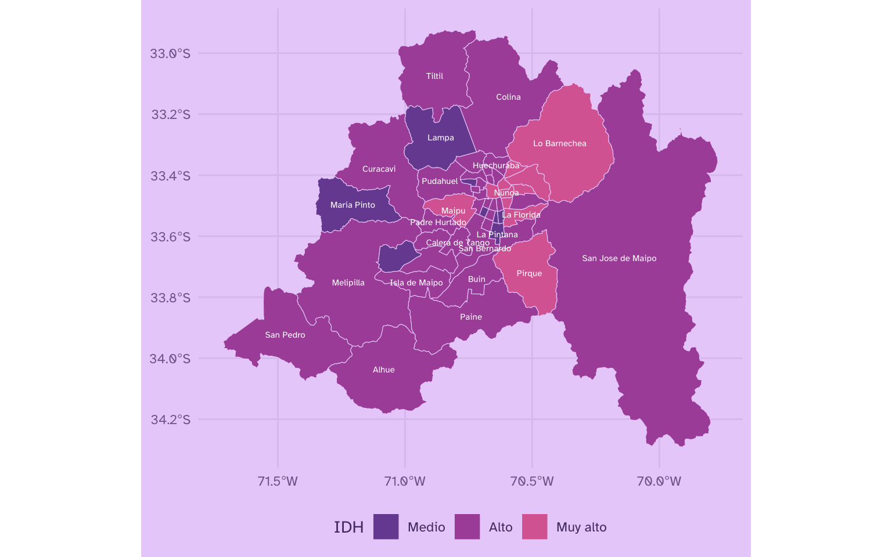

Sin embargo, podemos ver que estos mapas no se ajustan perfectamente a la imagen mental que tiene un ciudadano común acerca de cómo se ve la Región Metropolitana. Por ejemplo, vemos cómo la comuna de San José de Maipo abarca una superficie enorme dado que limita en la cordillera de los Andes con Argentina, o que comunas como Lo Barnechea se expanden hacia superficies cordilleranas de gran extensión.

Esto se debe a que ususalmente nos encontramos frente a mapas que representan el "Gran Santiago", es decir, sólo la superficie urbana de las comunas urbanas de la región, omitiendo sectores rurales, cordilleranos o deshabitados.

Por lo tanto, a continuación veremos cómo obtener un mapa urbano de la Región Metropolitana de Santiago.

## Mapa urbano de la región Metropolitana

En los siguientes pasos, pasaremos de un mapa comunal a un mapa comunal urbano; es decir, un mapa que **sólo considere la superficie urbana de las comunas**, en vez de la superficie total de las comunas.

Usando `{chilemapas}`, podemos obtener un mapa de la Región Metropolitana con un nivel de detalle mayor, que divide internamente las comunas en superficies más pequeñas que sólo corresponden a zonas urbanas:

``` r
# nombres de comunas
nombres_comunas <- chilemapas::codigos_territoriales |> select(matches("comuna"))

# obtener mapa por zonas rural/urbano
mapa_zonas_urbanas <- chilemapas::mapa_zonas |> 
  # definir geometrías
  st_set_geometry(chilemapas::mapa_zonas$geometry) |>
  # filtrar región
  filter(codigo_region == 13) |> 
  # agregar nombres de comunas
  left_join(nombres_comunas,
            by = join_by(codigo_comuna))
```

``` r
# mapa de zonas urbanas
mapa_zonas_urbanas |> 
  ggplot() +
  aes(geometry = geometry) +
  geom_sf(fill = "#553A74", color = "#EBD2FA", linewidth = 0.1)
```


Podemos mejorar esta visualización agrupando los polígonos por comuna y luego **uniendo** con `st_union()` las zonas urbanas intra-comunales en sus respectivas comunas, para volver a obtener un mapa comunal, pero que recorta las comunas para que sólo consideren su la **superficie urbana** de cada una:

``` r
# mapa de zonas urbanas
mapa_zonas_urbanas |> 
  # unir polígonos por comunas
  group_by(nombre_comuna, codigo_comuna) %>% 
  summarise(geometry = st_union(geometry), .groups = "drop") |>
  # visualizar
  ggplot() +
  geom_sf(fill = "#553A74", color = "#EBD2FA", linewidth = 0.1)
```

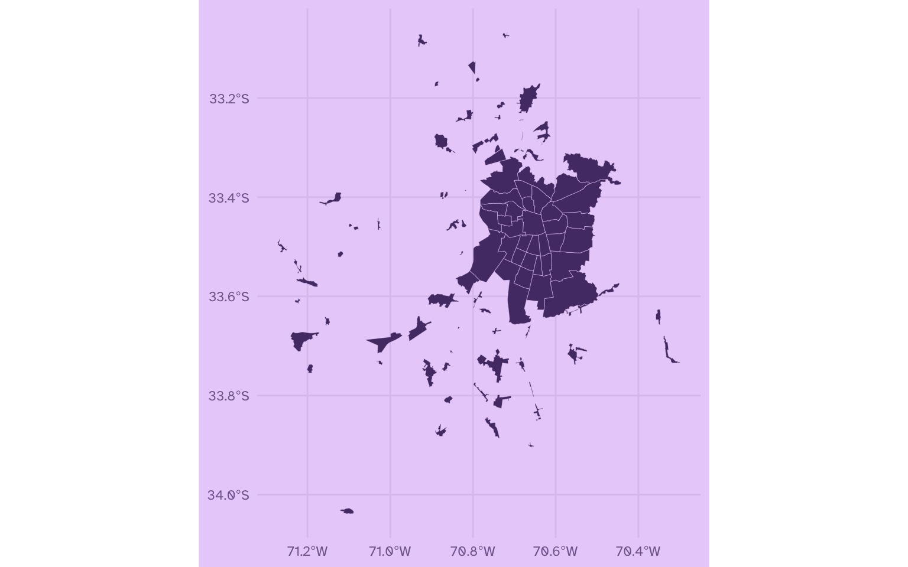

De inmediato, podemos ver que emerge una figura más familiar de lo que es el *Gran Santiago,* pero ahora tenemos otro problema: el mapa también contiene las zonas urbanas de comunas menos céntricas de la región, tales como Buin, Curacaví, Talagante y otras. Esto se debe a que nuestro mapa aún contiene comunas que no son mayoritariamente urbanas, dado que poseen sectores despoblados o de actividad agrícola, minera u otras, y que por consiguiente dan una apariencia discontinua a nuestro mapa.

Para resolver esto y dejar sólo las comunas urbanas del Gran Santiago, tenemos varias opciones: podemos filtrar específicamente las comunas que queremos, o bien, podemos filtrar en base a privincias, dejando sólo las provincias Santiago y Cordillera.

#### Definir contorno urbano por comunas exactas

**Opción 1:** seleccionar específicamente las comunas que queremos incluir:

``` r
comunas_urbanas <- c("Pudahuel", "Cerro Navia", "Conchali", "La Pintana", "El Bosque", 
                     "Estacion Central", "Pedro Aguirre Cerda", "Recoleta", "Independencia", 
                     "La Florida", "Penalolen", "Las Condes", "Lo Barnechea", "Quinta Normal", 
                     "Maipu", "Macul", "Nunoa", "Puente Alto", "Quilicura", "Renca", 
                     "San Bernardo", "San Miguel", "La Granja", "Providencia", "Santiago",
                     "San Joaquin", "Lo Espejo", "La Reina", "San Ramon", "La Cisterna", 
                     "Lo Prado", "Cerrillos", "Vitacura", "Huechuraba",
                     "San Jose de Maipo")

# mapa de sectores urbanos, de comunas urbanas
mapa_zonas_urbanas |> 
  # filtrar comunas urbanas
  filter(nombre_comuna %in% comunas_urbanas) |>
  # unir polígonos por comunas
  group_by(nombre_comuna, codigo_comuna) %>% 
  summarise(geometry = st_union(geometry)) |> 
  # graficar
  ggplot() +
  geom_sf(fill = "#553A74", color = "#EBD2FA", linewidth = 0.1)
```

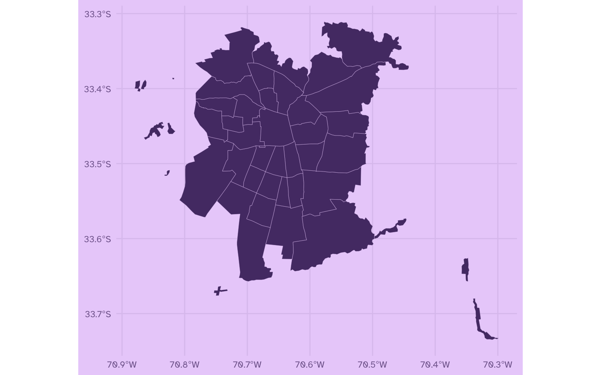

#### Definir contorno urbano en base a provincias

**Opción 2:** seleccionar las dos provincias que conforman el Gran Santiago, y agregar los ajustes que sean necesarios (incluir San Bernardo, excluir Pirque)

``` r
mapa_zonas_urbanas |> 
  # dejar solo dos provincias, incluir San Bernardo y sacar Pirque
  filter(codigo_provincia %in% c(131, 132) | nombre_comuna == "San Bernardo", nombre_comuna != "Pirque") |>
  # unir polígonos por comunas
  group_by(nombre_comuna, codigo_comuna) %>% 
  summarise(geometry = st_union(geometry)) |> 
  # graficar
  ggplot() +
  geom_sf(fill = "#553A74", color = "#EBD2FA", linewidth = 0.1)
```


La decisión que tomes depende de los objetivos del usuario y de tu visualzación, pero dejo ambas aproximaciones a modo de aprendizaje.

### Excluir islas urbanas

Luego de haber seleccionado las comunas urbanas que necesitamos, notamos que aún quedan algunas "islas urbanas" fuera de la zona principal del Gran Santiago. Usualmente vemos los mapas del Gran Santiago como una sola unidad geográfica contínua, sin separaciones ni islas a su alrededor. Por lo tanto, vamos a eliminar estos elementos externos a la superficie urbana contínua de forma manual.

Para identificar los polígonos que queramos remover, podemos visualizar una fracción del mapa y agregar etiquetas para dar con sus códigos geográficos, y así poder excluirlos. Por ejemplo, aquí lo haremos con Pudahuel:

``` r
mapa_zonas_urbanas |>
  filter(nombre_comuna == "Pudahuel") |>
  ggplot() +
  geom_sf(fill = "#553A74", color = "#EBD2FA", 
          linewidth = 0.1, alpha = 0.6) +
  geom_sf_label(
    aes(label = geocodigo), 
    color = "#EBD2FA", 
    fill = "#553A74",
    check_overlap = TRUE,
    size = 3)
```

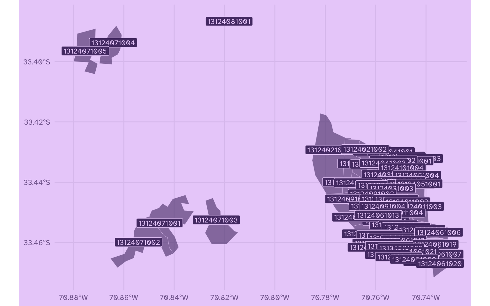

Bastaría con anotar los geocódigos para filtrarlos.

Entonces, en el siguiente paso removeremos estas pequeñas zonas urbanas de forma manual para obtener un mapa más contínuo.

``` r
# vector con geocódigos que deseamor remover
islas_urbanas <- c("13124071004", "13124071005", "13124081001", "13124071001", "13124071002", "13124071003", #Pudahuel
                   "13401121001", #San Bernardo
                   "13119131001", #Maipú
                   "13203031000", "13203031001", "13203031002", "13203011001", "13203011002" #San José de Maipo
)

# crear nuevo mapa
mapa_urbano <- mapa_zonas_urbanas |> 
  # filtrar solo comunas urbanas
  filter(nombre_comuna %in% comunas_urbanas) |>
  # filtrar islas urbanas
  filter(!geocodigo %in% islas_urbanas) |>
  # unir comunas
  group_by(nombre_comuna, codigo_comuna) %>%
  summarise(geometry = st_union(geometry)) |>
  ungroup()

# simplificar bordes del mapa (opcional)
# mutate(geometry = rmapshaper::ms_simplify(geometry,  keep = 0.4))
```

Y ahora el mapa resultante:

``` r
# graficar
mapa_urbano |> 
  ggplot() +
  geom_sf(fill = "#553A74", color = "#EBD2FA", 
          linewidth = 0.1, alpha = 0.8)
```

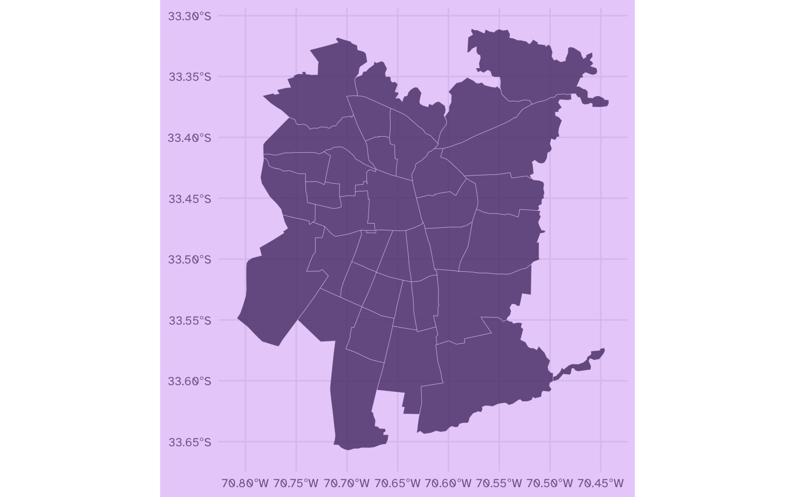

De esta forma ya logramos graficar un mapa del Gran Santiago mucho más definido y limpio.

### Visualizar datos en el mapa urbano

Teniendo este mapa, procedemos a visualizar nuestros datos tal como hicimos al principio de este tutorial:

``` r
# volvemos a adjuntar los datos que descargamos usando web scraping, esta vez al mapa nuevo
mapa_urbano_2 <- mapa_urbano |> 
  left_join(datos_comunas, by = "codigo_comuna")

mapa_urbano_2 |> 
  ggplot() +
  aes(fill = densidad_hab_km2) +
  geom_sf(col = "#EBD2FA") +
  scale_fill_continuous(palette = "PurpOr", 
                        labels = label_number(big.mark = ".", decimal.mark = ",")) +
  labs(fill = "Densidad poblacional")
```

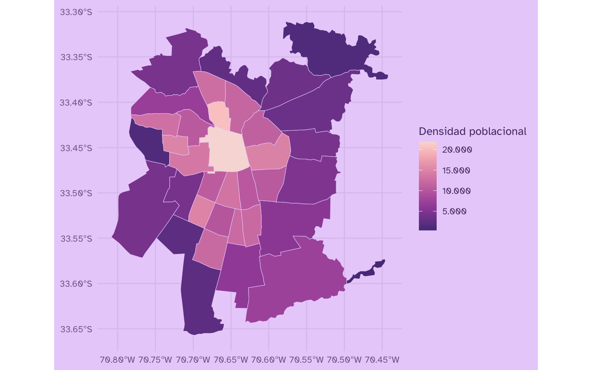

Finalmente, podemos poner nuestro nuevo mapa urbano de la Región Metropolitana de Santiago sobre el mapa de la región completa:

``` r
ggplot() +
  geom_sf(data = mapa,
          fill = "#D9BEEA", color = "#EBD2FA", linewidth = 0.3) +
  geom_sf(data = mapa_urbano_2,
          aes(fill = poblacion2020),
          color = "#EBD2FA", linewidth = 0.2) +
  scale_fill_continuous(palette = "PurpOr",
                        labels = label_number(big.mark = ".", decimal.mark = ",")) +
  labs(fill = "Población") +
  guides(fill = guide_colourbar(position = "inside")) +
  theme(legend.position.inside = c(.1, .7),
        legend.key.width = unit(3, "mm"),
        legend.key.height = unit(10, "mm"),
        legend.ticks.length = unit(0.4, "mm"))
```

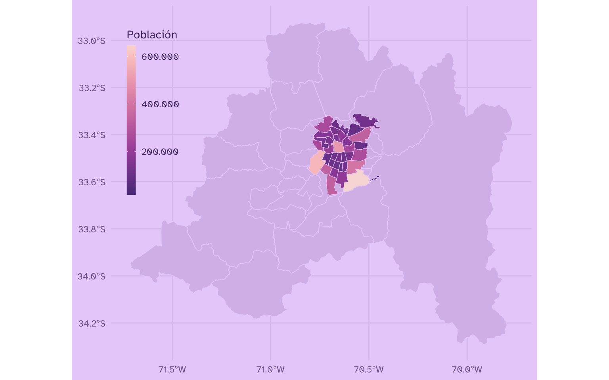

También podemos **recortar** el mapa con `coord_sf()` para hacerle un poco de zoom a la zona urbana dentro del contexto de la región completa:

``` r
ggplot() +
  geom_sf(data = mapa,
          aes(geometry = geometry),
          fill = "#D9BEEA", color = "#EBD2FA", linewidth = .4) +
  geom_sf(data = mapa_urbano_2,
          aes(geometry = geometry, fill = poblacion2020),
          color = "#EBD2FA", linewidth = 0.3) +
  scale_fill_continuous(palette = "PurpOr",
                        labels = label_number(big.mark = ".", decimal.mark = ",")) +
  # recortar con coordenadas 
  coord_sf(xlim = c(-70.95, -70.33), 
           ylim = c(-33.75, -33.2), 
           expand = F) +
  labs(fill = "Población") +
  theme(legend.position.inside = c(.1, .7),
        legend.key.width = unit(3, "mm"),
        legend.key.height = unit(10, "mm"),
        legend.ticks.length = unit(0.4, "mm"))
```

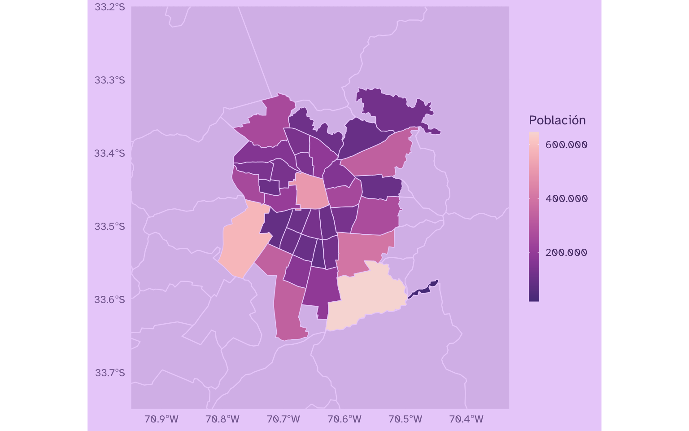





