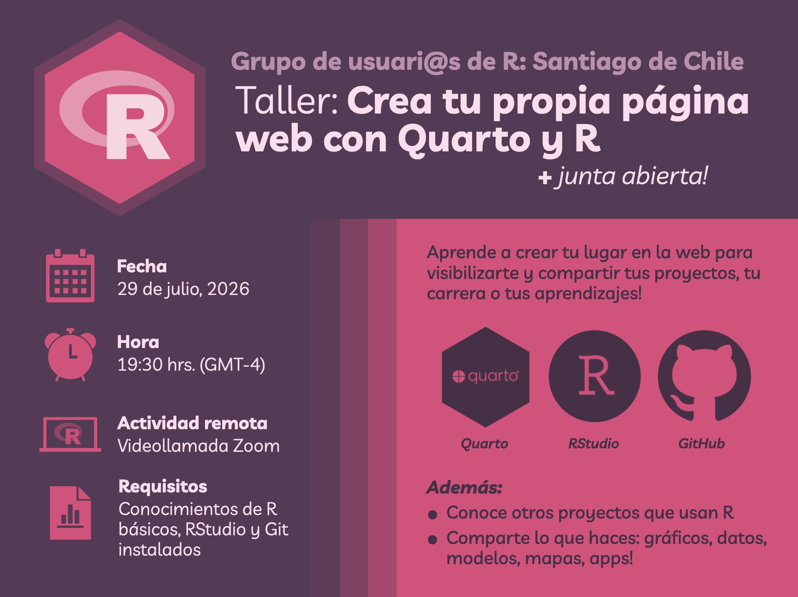

Para su reunión mensual del mes de julio, el [grupo de usuarias/os de R de Santiago de Chile](https://santiagorusers.github.io) realizó el taller **Crea tu página web con Quarto y R**, dictado por [Bastián Olea Herrera](https://bastianolea.rbind.io).

[Ya está disponible la **grabación** del taller!](#grabación-del-taller)

Durante el taller aprenderás a crear una página web utilizando Quarto, una herramienta sencilla y potente que te permitirá mostrar tu trabajo, proyectos, publicaciones, portafolio y mucho más, y también veremos cómo subir esta página a tu propio sitio gracias a GitHub Pages, para que cualquier persona pueda verla.

<i class='fas fa-laptop-code' style='font-size: 130%'></i> Antes de la reunión, asegúrate de tener:

* **R** y **RStudio** instalados [(ver instrucciones aquí)](https://bastianolea.github.io/aprende_r/#obtener-r)
* El software **Git** en tu computador [(descargar aquí)](https://git-scm.com)
* El paquete de R **Quarto** instalado: `install.packages("quarto")`
* Una cuenta de **GitHub** creada, ya que la utilizaremos para publicar nuestra página web!







### Grabación del taller

<iframe width="100%" height="420" style="border-radius:6px;" src="https://www.youtube.com/embed/S76UQMeUTuE?si=7vLtHwu_aA_cQYfA" title="YouTube video player" frameborder="0" allow="accelerometer; autoplay; clipboard-write; encrypted-media; gyroscope; picture-in-picture; web-share" referrerpolicy="strict-origin-when-cross-origin" allowfullscreen></iframe>

Nos puedes ayudar difundiendo nuestras actividades [en LinkedIn](https://www.linkedin.com/company/santiagorusers) y en [Twitter/X](https://x.com/SantiagoRusers/)
